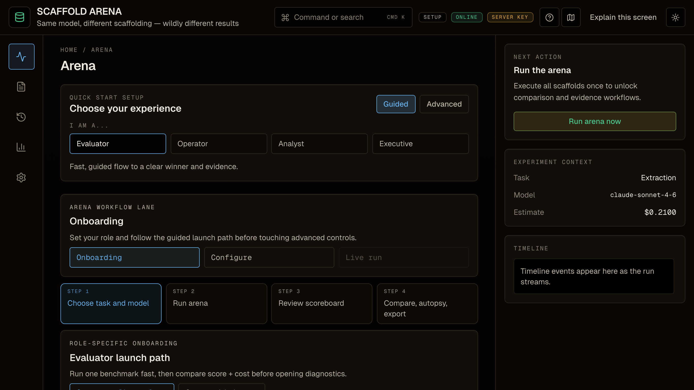
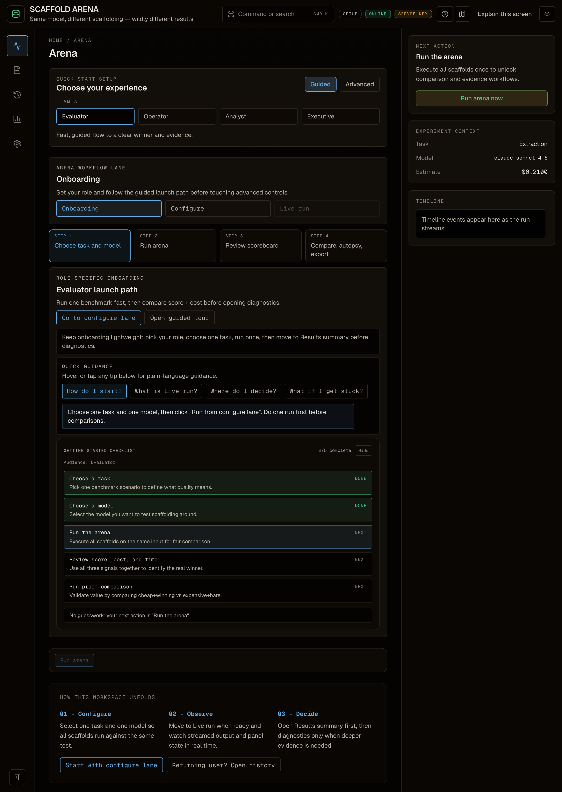
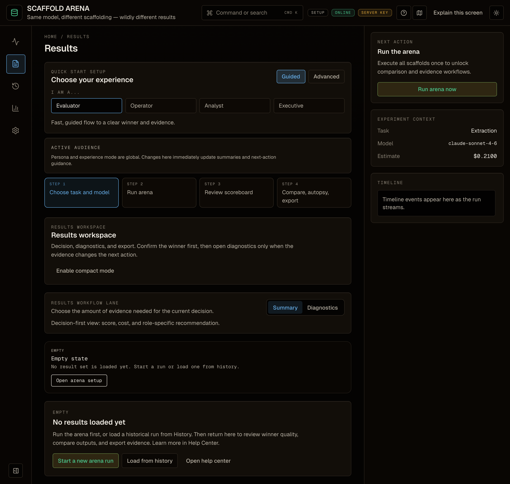
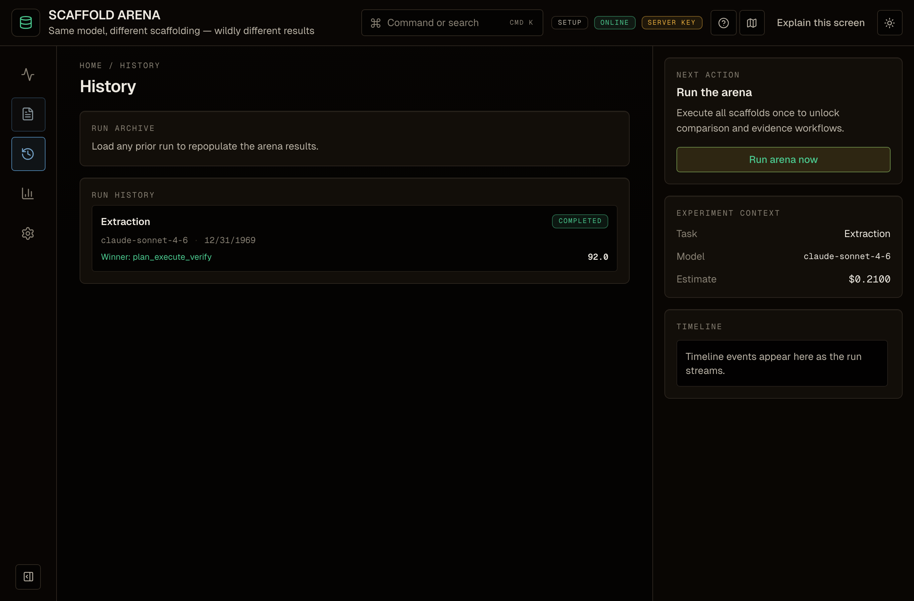
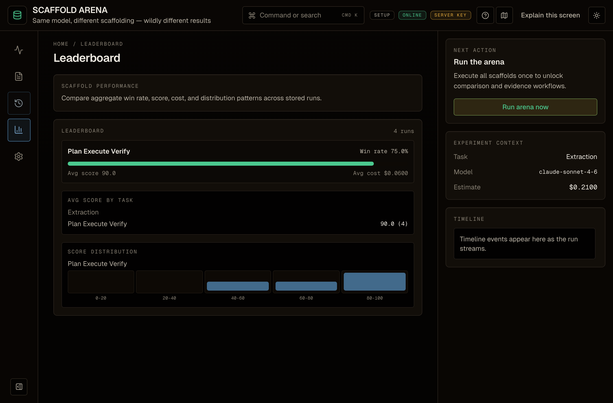
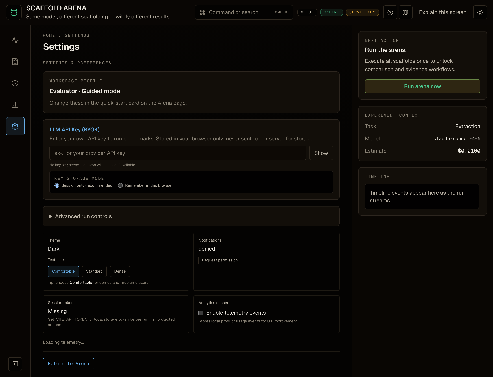
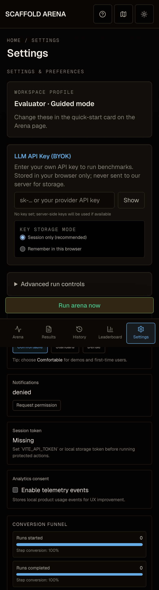
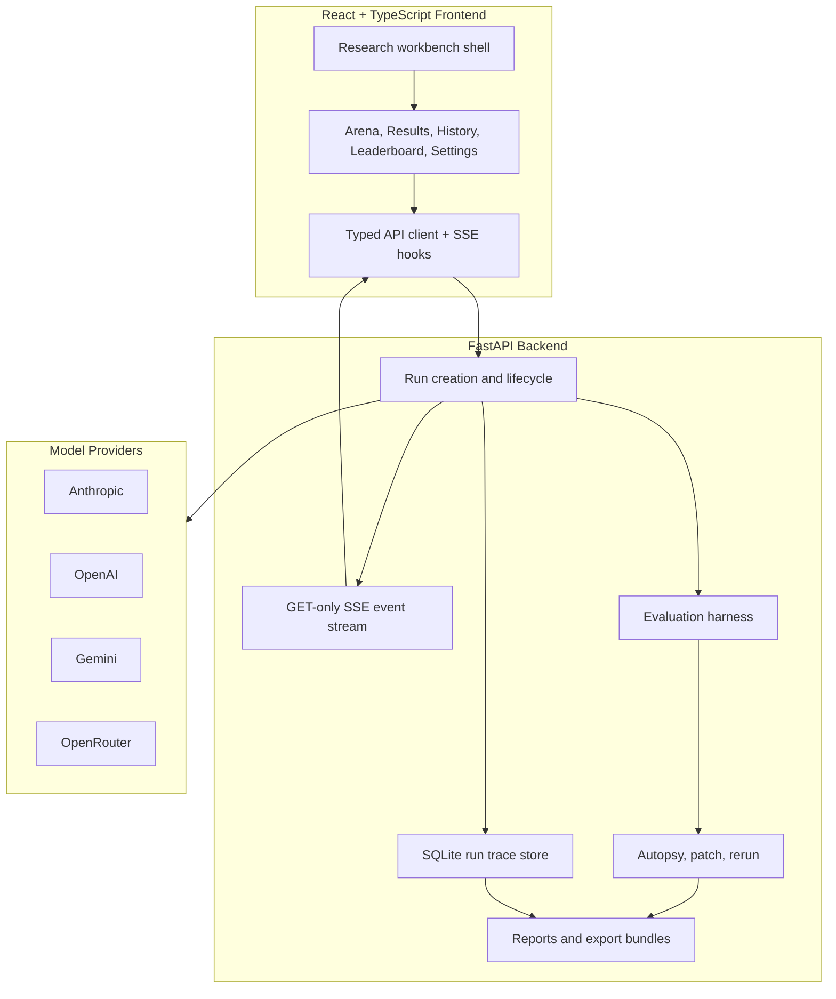

# Scaffold Arena

**Same model. Different scaffolding. Wildly different outcomes.**

Scaffold Arena is an enterprise-grade scaffold engineering workbench for testing the orchestration around LLMs. It answers a practical question: when quality is weak, should you buy a bigger model, or improve the scaffold around the model you already have?

<p align="center">
  
</p>

## Live Deployment

| Surface | URL |
| --- | --- |
| Frontend | [scaffold-arena.vercel.app](https://scaffold-arena.vercel.app) |
| Backend API | [scaffold-arena-production.up.railway.app](https://scaffold-arena-production.up.railway.app) |
| Health check | [/api/health](https://scaffold-arena-production.up.railway.app/api/health) |

## What It Proves

Most LLM evaluation stops at model choice. Scaffold Arena makes the surrounding system measurable:

- Run the same task through multiple scaffold strategies.
- Compare quality, cost, latency, and proof artifacts side by side.
- Diagnose failures with concrete evidence instead of subjective impressions.
- Patch a scaffold, rerun it, and export an audit trail.

The core loop is:

```text
Compare -> Diagnose -> Patch -> Rerun -> Export Audit Report
```

## Product Surface

Scaffold Arena is designed as a research-lab workbench, not a landing page. The first screen is the product: command bar, workspace rail, center workflow stage, and evidence inspector.

| Arena | Results | History |
| --- | --- | --- |
|  |  |  |

| Leaderboard | Settings | Mobile |
| --- | --- | --- |
|  |  |  |

## Capabilities

| Capability | What it does |
| --- | --- |
| Arena runs | Sends the same benchmark input through multiple scaffold strategies. |
| GET-only SSE streaming | Uses `POST /api/runs` followed by `GET /api/runs/{id}/events` for browser-native `EventSource` streaming. |
| Deterministic-first evaluation | Keeps deterministic scoring at 70% or higher for every task family. |
| Three-case proof comparison | Compares cheap+winning, expensive+bare, and expensive+winning runs. |
| Autopsy to patch to rerun | Converts failure evidence into a machine-applicable patch and reruns the scaffold. |
| Real usage costs | Computes cost from provider usage fields through the centralized model price table. |
| Export bundles | Produces run JSON, diagnostics, and Markdown audit reports for review. |
| Trace audit CLI | Audits saved run traces for ranked findings and regression keys. |

## Architecture



## Evaluation Model

Scaffold Arena treats deterministic checks as the anchor and optional judge criteria as a secondary layer.

| Task | Deterministic weight | Core signals |
| --- | ---: | --- |
| Extraction | 75% | Schema validity, field accuracy |
| Risk analysis | 85% | Must-flag hit rate, severity accuracy, false-positive control |
| Research synthesis | 85% | Citation coverage, required findings, schema validity, word compliance |

Synthetic sources are labeled in task context, UI result views, and reports. Costs come from real token usage, not hardcoded demo values.

## Trace-Driven Audit

The trace audit turns saved runs into a ranked engineering backlog. It is deterministic and offline, so it can run locally or in CI without provider keys.

```bash
uv run --project backend python scripts/trace-audit.py --limit 100
```

Audit a fixture and write a report:

```bash
uv run --project backend python scripts/trace-audit.py \
  --input backend/tests/fixtures/trace_audit/sample_runs.json \
  --output docs/reviews/trace-driven-frontier-audit.md
```

Current sample report: [docs/reviews/trace-driven-frontier-audit.md](docs/reviews/trace-driven-frontier-audit.md)

## Quick Start

### Prerequisites

- Python 3.11+
- Node 18+
- `uv`
- `pnpm` 10 recommended for this lockfile
- At least one provider key: `ANTHROPIC_API_KEY`, `OPENAI_API_KEY`, `GEMINI_API_KEY`, or `OPENROUTER_API_KEY`

### Install

```bash
git clone https://github.com/jlov7/scaffold-arena.git "Scaffold Arena"
cd "Scaffold Arena"

cd backend
cp .env.example .env
# Add at least one provider key to backend/.env
uv sync

cd ../frontend
npx -y pnpm@10 install
```

### Run Locally

```bash
# Terminal 1
cd backend
uv run uvicorn main:app --reload --port 8000
```

```bash
# Terminal 2
cd frontend
npx -y pnpm@10 dev
```

Open [http://localhost:5173](http://localhost:5173).

## Verification

Run the repo-level gate before publishing:

```bash
./scripts/verify-all.sh
```

That gate runs:

- Secret scan over tracked and untracked non-ignored files.
- Backend tests.
- Trace-audit smoke test.
- Frontend lint, unit tests, and production build.

Additional visual and interaction gates:

```bash
cd frontend
npx -y pnpm@10 test:e2e
npx -y pnpm@10 test:a11y
npx -y pnpm@10 verify:visual
```

Latest local verification on this branch:

| Gate | Result |
| --- | --- |
| `./scripts/verify-all.sh` | PASS |
| `frontend test:e2e` | 76 passed |
| `frontend test:a11y` | 11 passed |
| `frontend verify:visual` | 14 passed |
| `backend pytest` | 65 passed |
| `impeccable detect --json frontend/src` | `[]` |

## Repository Map

```text
backend/      FastAPI app, run engine, providers, evaluation, autopsy, reports
frontend/     React workbench, primitives, workspaces, SSE hooks, visual tests
docs/         Architecture, onboarding, reviews, screenshots, operations docs
scripts/      Repo verification, secret scanning, trace-audit tooling
specs/        Implementation specs for larger workstreams
```

Key docs:

- Product context: [PRODUCT.md](PRODUCT.md)
- Design system: [DESIGN.md](DESIGN.md)
- Documentation portal: [docs/README.md](docs/README.md)
- Getting started: [docs/getting-started.md](docs/getting-started.md)
- User guide: [docs/user-guide.md](docs/user-guide.md)
- Architecture: [docs/architecture.md](docs/architecture.md)
- API reference: [docs/api-reference.md](docs/api-reference.md)
- Evaluation: [docs/evaluation.md](docs/evaluation.md)
- Security review: [docs/security/frontend-security-review.md](docs/security/frontend-security-review.md)

## Engineering Standards

- Backend: Python, FastAPI, Pydantic, `uv`, SQLite persistence.
- Frontend: React, TypeScript, Vite, Tailwind CSS, Playwright, Vitest.
- API contract: preserve `POST /api/runs` then GET-only SSE.
- Package management: `uv` for Python, `pnpm` for frontend.
- Verification: deterministic tests first, visual checks for UI changes, trace audits for saved-run quality.

## Contributing

- Contributing guide: [CONTRIBUTING.md](CONTRIBUTING.md)
- Security policy: [SECURITY.md](SECURITY.md)
- Support policy: [SUPPORT.md](SUPPORT.md)
- Pull request template: [.github/pull_request_template.md](.github/pull_request_template.md)

Before opening a PR, run:

```bash
./scripts/verify-all.sh
cd frontend && npx -y pnpm@10 verify:visual
```

## Disclaimer

This is an independent personal project built outside employer scope. It does not represent any employer roadmap, strategy, endorsement, or official viewpoint.
