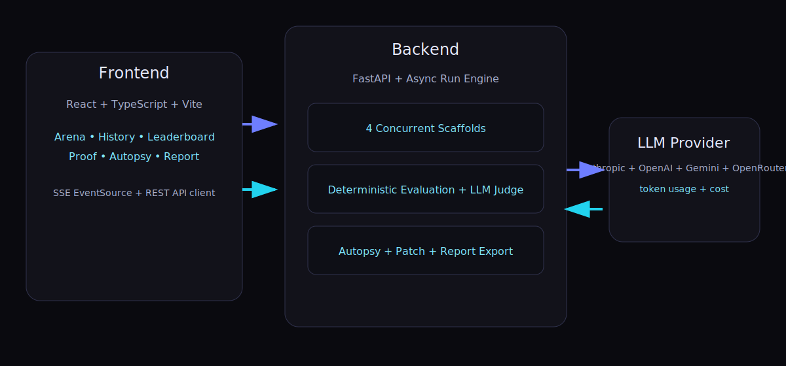
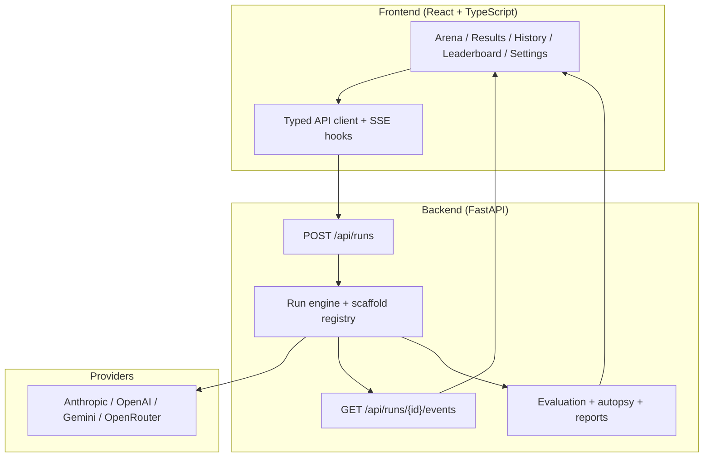
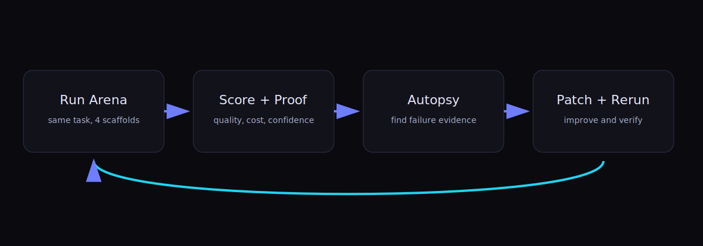

# Scaffold Arena

**Same model. Different scaffolding. Wildly different outcomes.**

Scaffold Arena is an evaluation workbench for a practical question:

> Is it better to buy a larger model, or improve the orchestration around the model you already have?

It runs the same benchmark input across multiple scaffold strategies, measures score/cost/time, explains failures with evidence, and supports one-click patch-and-rerun validation.


## Why This Repo Exists

Most teams default to model upgrades. This project demonstrates a higher-leverage path:

- Improve orchestration quality first.
- Measure quality per dollar, not raw model prestige.
- Keep decision evidence reproducible and auditable.

## For Non-Technical and Technical Readers

| Audience | Start Here | Outcome |
|---|---|---|
| Product / leadership | [Non-technical explainer](docs/explainers/non-technical.md) | Understand business value and decision framing |
| Engineers | [Technical explainer](docs/explainers/technical.md) | Understand architecture, execution flow, and extension points |
| New users | [Getting started](docs/getting-started.md) | Launch locally and complete first run |
| New contributors | [Onboarding guide](docs/onboarding.md) | Follow first-hour checklist and role paths |
| Operators / analysts | [User guide](docs/user-guide.md) | Navigate full compare -> diagnose -> patch -> prove loop |
| API consumers | [API reference](docs/api-reference.md) | Integrate against backend contracts |

## Product UX Model (Progressive Disclosure)

Scaffold Arena is intentionally split into lanes so first-time users are not overloaded:

1. `Arena -> Onboarding lane`: choose role and guided path.
2. `Arena -> Configure lane`: select task/model and launch run.
3. `Arena -> Live run lane`: monitor scaffold execution in real time.
4. `Results -> Summary lane`: decision-first score/cost/time readout.
5. `Results -> Diagnostics lane`: diff, autopsy, and proof comparison.


## Architecture at a Glance





## Benchmark Loop



1. Run benchmark.
2. Score and compare.
3. Diagnose failures.
4. Apply patch and rerun.
5. Export evidence.

## Deterministic-First Evaluation

Scaffold Arena enforces deterministic-heavy scoring (minimum 70% deterministic weight per task).

| Task | Deterministic Weight | Core deterministic signals |
|---|---:|---|
| Extraction | 75% | Schema validity, field accuracy |
| Risk analysis | 85% | Must-flag hit rate, severity accuracy, false-positive control |
| Research synthesis | 75% | Citation coverage, required findings, schema validity, word compliance |

Optional LLM judge criteria can be layered on top for subjective quality dimensions.

## Quick Start (Local)

### Prerequisites

- Python 3.11+
- Node 18+
- `uv`
- `pnpm`
- At least one provider API key (`ANTHROPIC_API_KEY`, `OPENAI_API_KEY`, `GEMINI_API_KEY`, or `OPENROUTER_API_KEY`)

### Install

```bash
git clone <repo-url> "Scaffold Arena"
cd "Scaffold Arena"

cd backend
cp .env.example .env
# add at least one provider key to backend/.env
uv sync

cd ../frontend
pnpm install
```

### Run

```bash
# Terminal 1
cd backend
uv run uvicorn main:app --reload --port 8000

# Terminal 2
cd frontend
pnpm dev
```

Open `http://localhost:5173`.

## Setup + Onboarding Paths

- First launch: [docs/getting-started.md](docs/getting-started.md)
- Team onboarding: [docs/onboarding.md](docs/onboarding.md)
- End-to-end usage: [docs/user-guide.md](docs/user-guide.md)
- Documentation portal: [docs/README.md](docs/README.md)

## Repository Structure

```text
backend/      FastAPI app, run engine, evaluation, autopsy, reports, backend tests
frontend/     React app, route/lane UX, telemetry, E2E/a11y/visual tests
docs/         Explainers, architecture, onboarding, ops playbooks, audits
```

### Structure Principles

- Product artifacts live in `backend/`, `frontend/`, and `docs/`.
- Generated runtime artifacts are ignored (`coverage`, Playwright/Lighthouse reports, local output dirs).
- Documentation is audience-oriented (non-technical, technical, onboarding, operations).

## Quality Gates

### Frontend

```bash
cd frontend
pnpm lint
pnpm test
pnpm build
pnpm test:e2e
pnpm test:a11y
pnpm test:visual
pnpm perf:budget
pnpm arch:layers
```

### Backend

```bash
cd backend
uv run pytest
```

## Visual Gallery

| Arena | Results Diagnostics | History |
|---|---|---|
|  |  |  |

| Leaderboard | Settings | Mobile |
|---|---|---|
|  |  |  |

## Security, Ops, and Review Docs

- Security review: [docs/security/frontend-security-review.md](docs/security/frontend-security-review.md)
- Frontend smoke + rollback: [docs/ops/frontend-smoke-and-rollback.md](docs/ops/frontend-smoke-and-rollback.md)
- Accessibility audit: [docs/reviews/accessibility-audit.md](docs/reviews/accessibility-audit.md)
- UX visual audit: [docs/reviews/ux-visual-audit-2026-02-21.md](docs/reviews/ux-visual-audit-2026-02-21.md)
- Release checklist: [docs/reviews/frontend-release-checklist.md](docs/reviews/frontend-release-checklist.md)

## Contributing and Policy

- Contributing guide: [CONTRIBUTING.md](CONTRIBUTING.md)
- Security policy: [SECURITY.md](SECURITY.md)
- Support policy: [SUPPORT.md](SUPPORT.md)
- Changelog: [CHANGELOG.md](CHANGELOG.md)
- License: [MIT](LICENSE)

---

**Disclaimer:** This is an independent personal project built outside employer scope. It does not represent any employer roadmap, strategy, endorsement, or official viewpoint.
