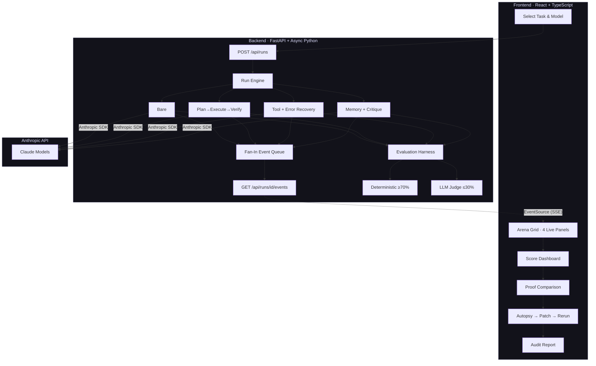
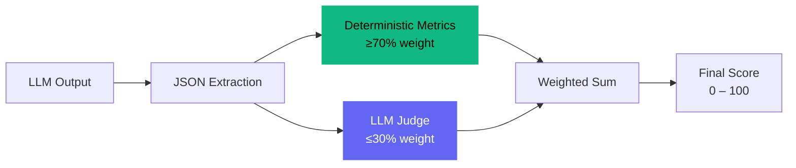

<div align="center">

```
 ╔═╗╔═╗╔═╗╔═╗╔═╗╔═╗╦  ╔╦╗
 ╚═╗║  ╠═╣╠╣ ╠╣ ║ ║║   ║║
 ╚═╝╚═╝╩ ╩╚  ╚  ╚═╝╩═╝═╩╝
       ╔═╗╦═╗╔═╗╔╗╔╔═╗
       ╠═╣╠╦╝║╣ ║║║╠═╣
       ╩ ╩╩╚═╚═╝╝╚╝╩ ╩
```

### Same model. Different scaffolding. Wildly different results.

[](LICENSE)
[](https://python.org)
[](https://typescriptlang.org)
[](https://fastapi.tiangolo.com)
[](https://react.dev)

An enterprise-grade workbench that proves — by measurement, not vibes — that the code *around* the model dominates outcomes in quality, reliability, and cost.

[Quick Start](#-quick-start) · [How It Works](#-how-it-works) · [Documentation](docs/) · [Architecture](docs/architecture.md)

</div>

---

## The Problem

Most teams chase model upgrades to improve AI output quality. Bigger model, higher cost, marginal gains.

But here's what nobody measures: **the same model produces wildly different results depending on how you orchestrate it.** The system prompt, the multi-step decomposition, the self-verification loop, the critique-and-refine cycle — this is *scaffolding*, and it's the single highest-leverage investment in any AI pipeline.

A well-scaffolded cheap model consistently outperforms an expensive model with no scaffolding. Higher quality. Lower cost. More reliable.

**Scaffold Arena proves this.** Live. Measured. Auditable.

## What This Proves

> We tested Claude Sonnet with four different scaffold architectures on the same task.
> The best scaffold scored 92.4. The worst scored 41.2. Same model. Same prompt. Same task.
> Then we proved the winning scaffold on the cheap model beats the expensive model running bare.

Three key findings:

| Finding | What It Means |
|---------|---------------|
| **Scaffolding beats model upgrades** | A well-orchestrated cheap model outperforms an expensive model with no scaffolding |
| **Quality varies 2-3x** | Different scaffold approaches on identical inputs produce dramatically different results |
| **Cost efficiency compounds** | Scaffold-optimized pipelines deliver higher quality per dollar spent |

## Features

### Real-Time Arena Comparison
Run four scaffold architectures simultaneously against the same task. Watch outputs stream token-by-token via SSE. See which approach wins — and by how much.

### Transparent, Deterministic Scoring
Every evaluation is **≥70% deterministic metrics** (schema validation, field accuracy, hit rates) with transparent, published weights. Optional LLM judge adds nuance for subjective criteria. No black-box scoring.

### 3-Case Proof Comparison
The "aha moment" — after the arena, prove scaffold value with three head-to-head cases:

```
Case 1: Cheap model  + winning scaffold    →  High quality, low cost
Case 2: Expensive model + no scaffold      →  Lower quality, high cost
Case 3: Expensive model + winning scaffold →  Highest quality, high cost
```

Case 1 vs. Case 2 is the money shot: better results at a fraction of the price.

### Failure Autopsy
When a scaffold loses, understand *why*. Automated failure classification with concrete evidence — missing fields, missed clauses, hallucinated sources — and machine-applicable patches.

### One-Click Patch & Rerun
Apply the autopsy's suggested fix and rerun with a single click. Verify the improvement immediately.

### Audit Report Export
Generate a comprehensive Markdown report documenting the full arena results, comparison data, and autopsy findings. Ready for stakeholders who need to see the numbers.

## How It Works



## Quick Start

### Prerequisites

- **Python 3.11+** — managed via [uv](https://docs.astral.sh/uv/)
- **Node.js 18+** — managed via [fnm](https://github.com/Schniz/fnm) or nvm
- **pnpm** — `npm install -g pnpm`
- **Anthropic API key** — [Get one here](https://console.anthropic.com/)

### Setup

```bash
# Clone the repository
git clone <repo-url> && cd scaffold-arena

# Backend
cd backend
cp .env.example .env          # Add your ANTHROPIC_API_KEY
uv sync                        # Install Python dependencies

# Frontend
cd ../frontend
pnpm install                   # Install Node dependencies
```

### Run

```bash
# Terminal 1: Backend
cd backend && uv run uvicorn main:app --reload --port 8000

# Terminal 2: Frontend
cd frontend && pnpm dev
```

Open **http://localhost:5173** — you're in the arena.

## The Arena in Action

### 1. Choose Your Battle

Select a task and model. Each task tests different AI capabilities — extraction precision, risk judgment, or multi-source synthesis.

```
┌─────────────────────┐  ┌─────────────────────┐  ┌─────────────────────┐
│  Structured          │  │  Risk Analysis       │  │  Research            │
│  Extraction          │  │                      │  │  Synthesis           │
│                      │  │                      │  │                      │
│  Parse legal         │  │  Flag risk clauses   │  │  Synthesize from     │
│  amendments into     │  │  from vendor          │  │  multiple sources    │
│  structured JSON     │  │  contracts           │  │  with citations      │
│                      │  │                      │  │                      │
│  ▪ extraction        │  │  ▪ risk_analysis     │  │  ▪ research          │
└─────────────────────┘  └─────────────────────┘  └─────────────────────┘
```

### 2. Watch the Fight

Four scaffold architectures race to complete the same task simultaneously. Outputs stream in real-time — you see every token as it's generated.

```
┌──────────────┐ ┌──────────────┐ ┌──────────────┐ ┌──────────────┐
│ Bare Prompt  │ │ Plan→Exec→   │ │ Tool + Error │ │ Memory +     │
│              │ │ Verify       │ │ Recovery     │ │ Critique     │
│ ● Streaming  │ │ ● Phase:     │ │ ● Phase:     │ │ ● Phase:     │
│              │ │   planning   │ │   validating │ │   critiquing │
│ {"amend...   │ │ Step 1:      │ │ Draft ok.    │ │ Subtask 3/5  │
│              │ │ Parse the... │ │ Checking...  │ │ Refining...  │
│              │ │              │ │              │ │              │
│ tokens: 1.2k│ │ tokens: 2.8k│ │ tokens: 3.1k│ │ tokens: 4.5k│
│ cost: $0.012│ │ cost: $0.031│ │ cost: $0.028│ │ cost: $0.052│
└──────────────┘ └──────────────┘ └──────────────┘ └──────────────┘
```

### 3. See the Scores

Transparent, weighted scoring. Hover any score for the full breakdown. The winner gets crowned; losers get diagnosed.

```
┌────────────────────────────────────────────────────────────────┐
│  RESULTS                                                       │
├──────┬─────────────────────┬───────┬────────┬───────┬─────────┤
│ Rank │ Scaffold            │ Score │ Cost   │ Time  │         │
├──────┼─────────────────────┼───────┼────────┼───────┼─────────┤
│ 1.   │ 🏆 Memory+Critique │ 92.4  │ $0.052 │ 8.3s  │         │
│ 2.   │ Plan→Exec→Verify   │ 78.1  │ $0.031 │ 5.1s  │ Autopsy │
│ 3.   │ Tool+Error Recovery │ 64.7  │ $0.028 │ 4.8s  │ Autopsy │
│ 4.   │ Bare Prompt         │ 41.2  │ $0.012 │ 2.1s  │ Autopsy │
└──────┴─────────────────────┴───────┴────────┴───────┴─────────┘
```

### 4. Prove the Value

Run the 3-case proof comparison to demonstrate that scaffolding beats raw model power.

```
┌─────────────────────────────────────────────────────────────────────┐
│  PROOF COMPARISON                                                   │
├─────────────────────┬──────────┬────────┬───────┬─────────┬────────┤
│ Case                │ Model    │ Score  │ Cost  │ QPD     │ Result │
├─────────────────────┼──────────┼────────┼───────┼─────────┼────────┤
│ Cheap + Winner      │ Haiku    │  87.3  │$0.008 │* 10.9k  │  PASS  │
│ Expensive + Bare    │ Sonnet   │  41.2  │$0.012 │   3.4k  │  FAIL  │
│ Expensive + Winner  │ Sonnet   │  92.4  │$0.052 │   1.8k  │  PASS  │
├─────────────────────┴──────────┴────────┴───────┴─────────┴────────┤
│  * best quality-per-dollar    QPD = score / (cost × 1000)          │
│                                                                     │
│  KEY INSIGHT: Cheap model + good scaffold beats expensive model    │
│  running bare — at 33% of the cost with 2x the quality.            │
└─────────────────────────────────────────────────────────────────────┘
```

### 5. Diagnose & Fix

Run an autopsy on any losing scaffold. Get concrete failure analysis with evidence and a machine-applicable patch. Apply it and rerun with one click.

### 6. Export Everything

Generate a comprehensive audit report for stakeholders. Download as Markdown or PDF. Every number is traceable back to the evaluation methodology.

## Evaluation Methodology

Scaffold Arena uses a transparent, reproducible evaluation system. **Deterministic metrics carry ≥70% of the weight** for every task type — no hidden judgments.



### Weight Tables

<table>
<tr>
<th>Task</th>
<th>Deterministic Metrics (≥70%)</th>
<th>LLM Judge (≤30%)</th>
</tr>
<tr>
<td><strong>Extraction</strong></td>
<td>

| Metric | Weight |
|--------|--------|
| Schema validity | 45% |
| Field accuracy | 30% |

</td>
<td>

| Metric | Weight |
|--------|--------|
| Completeness | 15% |
| Reasoning clarity | 10% |

</td>
</tr>
<tr>
<td><strong>Risk Analysis</strong></td>
<td>

| Metric | Weight |
|--------|--------|
| Must-flag hit rate | 45% |
| Risk level accuracy | 20% |
| False positive rate | 10% |
| Structure compliance | 10% |

</td>
<td>

| Metric | Weight |
|--------|--------|
| Recommendation quality | 15% |

</td>
</tr>
<tr>
<td><strong>Research Synthesis</strong></td>
<td>

| Metric | Weight |
|--------|--------|
| Citation coverage | 35% |
| Required findings | 25% |
| Schema validity | 15% |
| Word count compliance | 10% |

</td>
<td>

| Metric | Weight |
|--------|--------|
| Synthesis quality | 10% |
| Recommendation quality | 5% |

</td>
</tr>
</table>

Full methodology details: [docs/evaluation.md](docs/evaluation.md)

## The Four Scaffolds

Each scaffold represents a fundamentally different approach to orchestrating the same LLM:

```
                    ┌─────────────────────────────────────────────────────────┐
                    │              SCAFFOLD COMPLEXITY SPECTRUM                │
                    │                                                         │
  Simplest ◄────────────────────────────────────────────────────► Most Complex
                    │                                                         │
   Bare             │   Plan→Execute     Tool + Error       Memory +          │
   Prompt           │   →Verify          Recovery           Critique          │
                    │                                                         │
   1 API call       │   3 API calls      2-5 API calls      5-7 API calls    │
   No orchestration │   Structured       Validation loop    Multi-pass        │
                    │   decomposition    with auto-repair   with self-review  │
                    │                                                         │
                    └─────────────────────────────────────────────────────────┘
```

| Scaffold | Strategy | How It Works | Typical API Calls |
|----------|----------|--------------|:-----------------:|
| **Bare Prompt** | Zero scaffolding | Single prompt → single response. The control group. | 1 |
| **Plan → Execute → Verify** | Structured decomposition | Plans approach first, executes the plan, then self-verifies against the schema. | 3 |
| **Tool + Error Recovery** | Validation loop | Drafts output, validates against schema, auto-repairs errors up to 3 cycles. | 2–5 |
| **Memory + Critique** | Multi-pass refinement | Decomposes task, executes subtasks with memory, synthesizes, self-critiques, refines. | 5–7 |

Full scaffold architecture details: [docs/scaffolds.md](docs/scaffolds.md)

## The Three Tasks

All tasks use **synthetic data** (clearly labeled throughout the UI) designed to isolate specific capabilities:

| Task | What It Tests | Key Metrics | Input |
|------|---------------|-------------|-------|
| **Structured Extraction** | Precision, schema adherence | Schema validity, field-by-field accuracy | Legal amendment document |
| **Risk Analysis** | Judgment, completeness, false positive control | Must-flag hit rate, risk level accuracy | Vendor contract with risk clauses |
| **Research Synthesis** | Multi-source reasoning, citation discipline | Citation coverage, required findings | Synthetic research sources |

> **Why synthetic data?** Using synthetic sources ensures reproducibility, eliminates copyright concerns, and makes the evaluation entirely self-contained. Every source is labeled as synthetic in the task card, prompt preamble, and report footer.

## Tech Stack

| Layer | Technology | Why |
|-------|------------|-----|
| **Backend** | Python 3.11+ / FastAPI | Async-native, fast, Pydantic validation |
| **LLM** | Anthropic SDK | Direct streaming, structured usage tracking |
| **Streaming** | SSE (sse-starlette) | GET-compatible EventSource, no WebSocket complexity |
| **Frontend** | React 18 / TypeScript | Type-safe components, hooks architecture |
| **Build** | Vite | Sub-second HMR, optimized production builds |
| **Styling** | Tailwind CSS v4 | CSS-variable design tokens, zero runtime |
| **Backend Deps** | uv | Fast, deterministic Python package management |
| **Frontend Deps** | pnpm | Efficient, strict Node package management |

## Project Structure

```
scaffold-arena/
├── backend/
│   ├── main.py                      # FastAPI app + all routes
│   ├── config/
│   │   ├── settings.py              # Pydantic BaseSettings (env-based)
│   │   └── models.py                # Model registry + pricing (single source of truth)
│   ├── core/
│   │   ├── run_engine.py            # Run lifecycle, fan-in queue, SSE streaming
│   │   ├── events.py                # 15 event types + SSE frame formatting
│   │   ├── provider.py              # Anthropic SDK wrapper (streaming + complete)
│   │   └── registry.py              # Task + scaffold registries
│   ├── scaffolds/
│   │   ├── base.py                  # Abstract scaffold interface
│   │   ├── bare.py                  # Single-shot baseline
│   │   ├── plan_execute_verify.py   # 3-phase structured approach
│   │   ├── tool_error_recovery.py   # Validation + auto-repair loop
│   │   └── memory_critique.py       # Multi-pass with self-review
│   ├── tasks/
│   │   ├── base.py                  # Abstract task interface
│   │   ├── extraction.py            # Legal amendment extraction
│   │   ├── risk_analysis.py         # Contract risk analysis
│   │   └── research_synthesis.py    # Multi-source synthesis
│   ├── evaluation/
│   │   ├── harness.py               # Orchestrates deterministic + judge scoring
│   │   ├── deterministic.py         # 9 deterministic scoring functions
│   │   └── llm_judge.py             # Task-specific LLM rubrics
│   ├── autopsy/
│   │   └── analyzer.py              # Failure classification + patch generation
│   ├── report/
│   │   ├── markdown.py              # Audit report (Markdown)
│   │   └── pdf.py                   # Optional PDF export (weasyprint)
│   └── utils/
│       ├── json_extract.py          # Resilient JSON parsing (4 fallback strategies)
│       └── text.py                  # Fuzzy matching utilities
│
├── frontend/
│   ├── src/
│   │   ├── App.tsx                  # Main orchestration (5 state groups)
│   │   ├── api/client.ts            # Typed API client
│   │   ├── hooks/
│   │   │   ├── useArenaRun.ts       # RAF-buffered streaming state
│   │   │   └── useSSE.ts            # EventSource hook (15 event types)
│   │   ├── components/
│   │   │   ├── TaskSelector.tsx      # Task cards + model dropdown
│   │   │   ├── ArenaGrid.tsx         # Responsive 4-panel grid
│   │   │   ├── ArenaPanel.tsx        # Individual panel (animated scores)
│   │   │   ├── StreamingText.tsx     # Direct DOM text rendering
│   │   │   ├── ScoreDashboard.tsx    # Ranked results + score tooltips
│   │   │   ├── ProofComparison.tsx   # 3-case comparison table + QPD
│   │   │   ├── AutopsyModal.tsx      # Failure analysis + patch view
│   │   │   └── ReportModal.tsx       # Report preview + download
│   │   ├── types/index.ts           # All TypeScript interfaces
│   │   └── styles/theme.css         # Dark Precision design tokens
│   └── vite.config.ts               # React + Tailwind + API proxy
│
├── docs/                            # Detailed documentation
├── CLAUDE.md                        # AI coding assistant context
├── CONTRIBUTING.md                  # Contribution guidelines
└── LICENSE                          # MIT License
```

## API Reference

| Method | Endpoint | Purpose |
|--------|----------|---------|
| `GET` | `/api/health` | Health check |
| `GET` | `/api/meta` | Models, tasks, scaffolds, feature flags |
| `POST` | `/api/runs` | Start arena run → returns `stream_url` |
| `GET` | `/api/runs/{id}/events` | SSE event stream (EventSource-compatible) |
| `POST` | `/api/runs/{id}/cancel` | Cancel a running arena |
| `POST` | `/api/comparisons` | Start 3-case proof comparison |
| `POST` | `/api/autopsy` | Analyze failures + generate patch |
| `POST` | `/api/patch-reruns` | Rerun scaffold with patch applied |
| `POST` | `/api/reports` | Generate Markdown + optional PDF report |

Full API documentation: [docs/api-reference.md](docs/api-reference.md)

## Documentation

| Document | Audience | Description |
|----------|----------|-------------|
| [Architecture](docs/architecture.md) | Engineers | System design, data flow, SSE streaming, async patterns |
| [Getting Started](docs/getting-started.md) | Everyone | Detailed setup, configuration, first run walkthrough |
| [User Guide](docs/user-guide.md) | Everyone | Complete guide to using Scaffold Arena |
| [Evaluation Methodology](docs/evaluation.md) | Data/ML teams | Deep dive into scoring, weights, deterministic vs. judge |
| [Scaffold Architectures](docs/scaffolds.md) | Engineers | How each scaffold works, when to use each approach |
| [API Reference](docs/api-reference.md) | Engineers | Full endpoint documentation with request/response examples |

## Design System

Scaffold Arena uses the **Dark Precision** design language — dark backgrounds, monospace typography, and color-coded semantic signals:

```
Background:   #0a0a0f → #12121a → #1a1a2e    (depth layers)
Typography:   JetBrains Mono (data) / System sans-serif (body)
Winner:       #10b981  (emerald)               ██
Loser:        #ef4444  (red)                   ██
Info/Active:  #6366f1  (indigo)                ██
Warning:      #f59e0b  (amber)                 ██
```

## Important Notes

- **Synthetic data**: The Research Synthesis task uses synthetic demo sources that are not real publications. These are clearly labeled throughout the application (task card, prompt preamble, UI, report footer).
- **Cost awareness**: All costs are computed from real token usage via the Anthropic SDK, using the centralized price table in `config/models.py`. No estimates or approximations.
- **Streaming performance**: Text deltas are buffered in React refs and flushed via `requestAnimationFrame` — never `setState` per token.

## Contributing

We welcome contributions. See [CONTRIBUTING.md](CONTRIBUTING.md) for guidelines.

## License

MIT License — see [LICENSE](LICENSE) for details.

---

<div align="center">

**Built to prove that how you use AI matters more than which AI you use.**

Made with [Claude Code](https://claude.ai/code)

</div>
