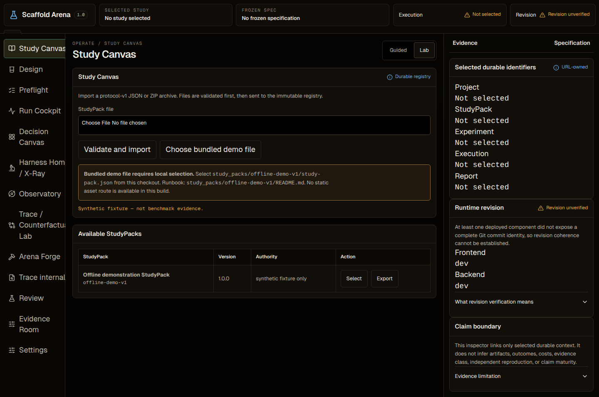
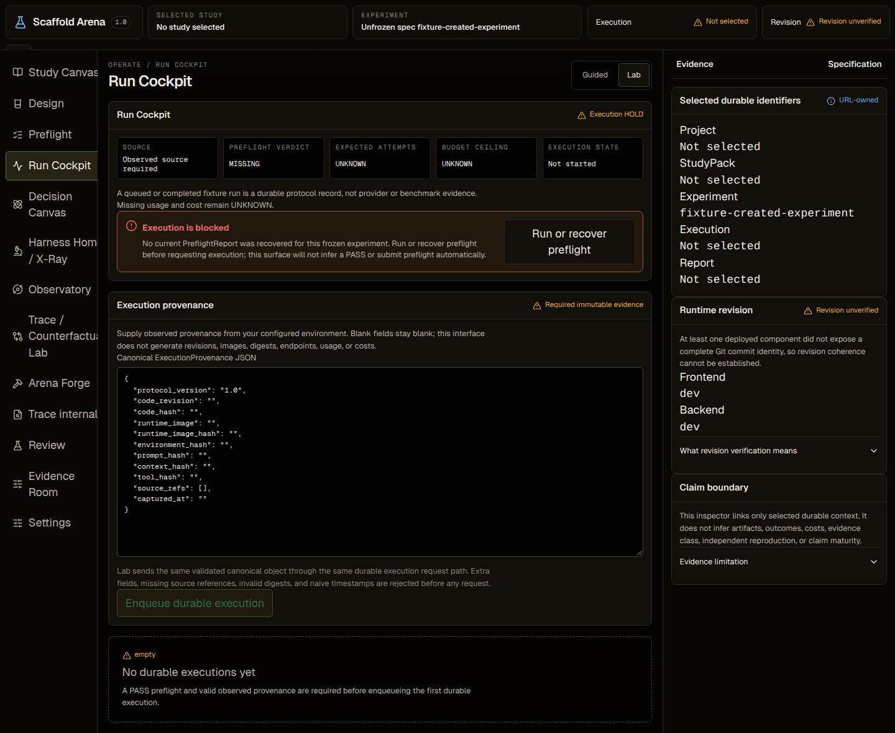
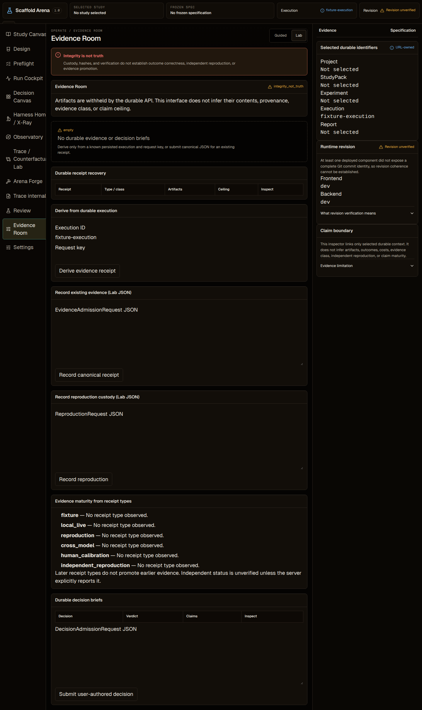
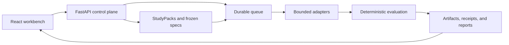

# Scaffold Arena

[](.github/workflows/ci.yml)


[](LICENSE)

Teams add planners, memory policies, retry loops, and verifiers to agents every week. When a demo improves, it is often hard to tell which change helped, whether the gain is consistent, what it costs, or which failures the final score concealed.

Scaffold Arena helps builders compare those changes under a declared design. It freezes inputs, checks controls before execution, retains durable attempts and severe failures, and produces an inspectable record for the next decision.

**Current status: 0.9.1 candidate.** **0.9.1 beta** is unreleased. This candidate demonstrates a local synthetic fixture path, a reproducible fixed context-handoff protocol, and a mock-validated Workbench path. [Evidence status](docs/evidence-status.md) is authoritative: no completed comparative live study, human calibration, or independent reproduction is recorded.

Not supported:

- A fixture sample is a live benchmark result.
- A synthetic source is a real publication.

## Run the provider-free browser demo

The first workflow uses two local processes. The API serves a bundled synthetic fixture; Vite serves the Workbench and proxies API requests. Both bind to loopback, and the fixture invokes no provider.

Requires Python 3.11+, Node.js 20+ (including npm/npx), `uv`, and pnpm 10, which the commands invoke through `npx`.

```bash
git clone https://github.com/jlov7/scaffold-arena.git
cd scaffold-arena

# Terminal 1
cd backend
uv sync --frozen --extra dev --extra research
uv run arena serve --host 127.0.0.1 --port 8000 --enable-offline-demo
```

```bash
# Terminal 2, from the repository root
cd frontend
npx -y pnpm@10 install --frozen-lockfile
VITE_API_PROXY_TARGET=http://127.0.0.1:8000 npx -y pnpm@10 dev --host 127.0.0.1
```

Open [http://127.0.0.1:5173](http://127.0.0.1:5173), then:

1. Import the labelled `offline-demo-v1` StudyPack.
2. Create and freeze an experiment with explicit owner approval.
3. Run local preflight and inspect a `PASS` or `HOLD`.
4. Start the bounded 80-attempt synthetic fixture only after `PASS`.
5. Recover the durable run, create immutable analysis, and export the CSV evidence.

The visible output includes the frozen design, preflight status, durable execution state, unknown usage or cost where it is unavailable, exclusions, integrity checks, and claim ceiling.

## What you get

Arena helps a builder answer a defined question such as: “Under the same model, task, environment, and budget, what changes when this harness mechanism changes?”

- **A declared comparison to review.** Versioned StudyPacks and frozen experiment specifications bind scenarios, controls, budgets, and evaluation before a run.
- **Earlier feedback on missing controls.** Preflight returns a typed `HOLD` for capability, manipulation, budget, isolation, or adequacy problems before an execution is admitted.
- **Failures and unknowns in context.** Durable attempts, deterministic checks, severe-failure retention, traces, and usage or cost fields show what was observed and what remains unknown.
- **A record others can inspect.** Reports and receipts carry the input bindings, exclusions, integrity checks, and claim ceiling alongside the output.

Guided mode keeps the current status, next action, and claim limit in view. Lab exposes the same persisted records, identifiers, trace payloads, and provenance for technical inspection.

## Context-handoff study question

What should a worker inherit: an isolated prompt, all available context, or a fixed curated subset? The included local study holds its declared runtime, task packets, seeds, and zero-paid pricing fixed while varying that delivery policy. Read the [local-study guide](docs/context-handoff-local-study.md) for the no-inference preflight, explicit dispatch, fresh-output, verifier, and interpretation limits; the [StudyPack](study_packs/context-handoff-local-v1/study-pack.json) and [preregistration](study_packs/context-handoff-local-v1/fixtures/preregistration.md) define the frozen design.

The first local pilot stopped after an initial GET connection failure: it made zero `/api/chat` POSTs, and it did not complete a comparison. It therefore does not rank context policies or support an effect claim.

## Run the separate CLI provenance example

The browser demo launches the Workbench. The CLI example below is separate: it creates a fresh empty output directory, validates the bundled fixture inputs, and writes a descriptive local decision card and provenance records.

```bash
# From the repository root
cd backend
demo_dir="$(mktemp -d /tmp/scaffold-arena-demo.XXXXXX)"
uv run arena demo --path "$demo_dir"
```

Do not reuse a prior output directory. The command refuses non-empty output locations. Its `full_execution_command` describes the matching durable fixture chain; it does not open the Workbench.

## Why keep the record

Frozen inputs, preflight, durable attempts, deterministic evaluation, severe-failure retention, and receipts make a study easier to audit and repeat. They let an engineer show a reviewer what was declared, what ran, which fields are unknown, and where the evidence stops.

## Relationship to existing work

Scaffold Arena shares ground with current agent-evaluation tools and research. [Harness-Bench](https://arxiv.org/abs/2605.27922) directly studies configuration-level harness effects under shared conditions. [Inspect](https://inspect.aisi.org.uk/agent-bridge.html) supports external agents, sandbox bridges, approval policies, and transcripts. [Harbor](https://www.harborframework.com/docs) and [Terminal-Bench](https://github.com/harbor-framework/terminal-bench) provide task environments and agent execution infrastructure.

Arena does not claim to replace these projects or to have demonstrated an advantage over them. Its proposed contribution is an evidence-bounded factorial study protocol. [The comparison note](docs/benchmarking/comparison_to_existing_tools.md) records the current boundary and open gaps.

## Workbench views

These browser-rendered product-tour captures show synthetic, blocked, or empty states. They document the interface and have no benchmark, provider, usability, or model-performance meaning.







[See all desktop and mobile product-tour views.](docs/product-tour.md)

## Architecture


```mermaid
flowchart LR
    UI["React workbench"]
    API["FastAPI control plane"]
    Registry["StudyPacks and frozen specs"]
    Queue["Durable queue"]
    Workers["Bounded adapters"]
    Eval["Deterministic evaluation"]
    Evidence["Artifacts, receipts, and reports"]

    UI --> API --> Registry
    API --> Queue --> Workers --> Eval --> Evidence
    Registry --> Queue
    Evidence --> UI
```

The API process does not own attempt execution. Workers lease durable jobs, persist append-only events, and recover expired leases. Personal deployments use loopback services, SQLite, and local artifacts. Team deployments add PostgreSQL, object storage, authenticated sessions, RBAC, and project-scoped workers.

[Architecture](docs/architecture.md) · [Protocol-v1 schemas](specs/v1/README.md) · [Adapter certification](docs/adapters/certification.md) · [Examples](examples/README.md)

## Verify a candidate

```bash
./scripts/verify-all.sh
./scripts/verify-release-gates.sh
./scripts/verify-clean-clone.sh
```

The release gate includes the isolated real-backend offline browser smoke at desktop and mobile widths. It retains temporary local screenshots, CSV exports, and typed provenance for that run. Those captures are local fixture-journey evidence only.

[Release verification](docs/ops/release-verification.md) · [Changelog](CHANGELOG.md) · [Security policy](SECURITY.md) · [Contributing](CONTRIBUTING.md)

<sub>This is a personal research and development project. It is not affiliated with, endorsed by, or sponsored by my employer. Any views expressed are my own.</sub>
