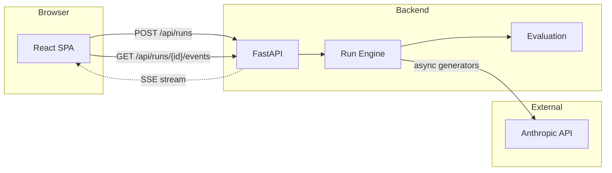
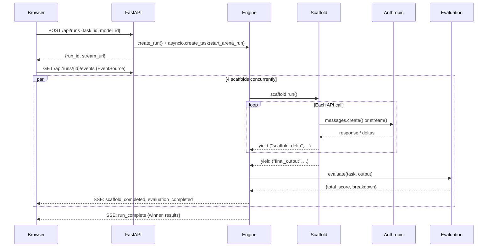

# Architecture

> How Scaffold Arena is built, and why.

## System Overview

Scaffold Arena is a monorepo with two services — a Python backend and a React frontend — communicating via REST + SSE.



## Design Principles

| Principle | Implementation |
|-----------|---------------|
| **Streaming-first** | Every scaffold yields events via async generators. The frontend sees tokens as they're produced. |
| **Deterministic by default** | Evaluation is >=70% deterministic metrics. No hidden judgments. |
| **Fan-in concurrency** | All 4 scaffolds run concurrently, pushing events to a shared `asyncio.Queue`. One SSE stream serves them all. |
| **Single source of truth** | Model pricing lives in `config/models.py`. Costs are always computed, never estimated. |
| **Cancellation-safe** | Every scaffold checks a `cancelled_check` callback between API calls. |

---

## Backend Architecture

### Layer Structure

```
backend/
├── main.py              # HTTP layer: routes, request/response models
├── config/              # Configuration (env, model pricing)
├── core/                # Engine, events, provider, registry
├── scaffolds/           # 4 scaffold implementations
├── tasks/               # 3 task definitions (input, schema, gold)
├── evaluation/          # Deterministic + LLM judge scoring
├── autopsy/             # Failure analysis + patch generation
├── report/              # Markdown + PDF export
└── utils/               # JSON extraction, fuzzy matching
```

### Request Lifecycle

A typical arena run follows this path:



### The Fan-In Queue

The core concurrency pattern is a **fan-in queue**. Each scaffold runs as an independent `asyncio.Task`, yielding events. The run engine collects these events into a single `asyncio.Queue`, which the SSE endpoint drains:

```python
# Simplified from core/run_engine.py
run.queue = asyncio.Queue()

# Launch all scaffolds concurrently
tasks = [
    asyncio.create_task(_run_single_scaffold(run, sid, provider))
    for sid in run.scaffold_ids
]
await asyncio.gather(*tasks, return_exceptions=True)
```

This means the frontend receives events from all 4 scaffolds through **one SSE connection**, interleaved by arrival order. The frontend demultiplexes by `scaffold_id`.

### SSE Event Protocol

Events are sent as standard Server-Sent Events with JSON payloads. Every event includes `run_id` and `ts_ms`.

**Arena events:**

| Event | Payload | When |
|-------|---------|------|
| `run_started` | `{run_id, task_id, scaffold_ids}` | Run begins |
| `scaffold_started` | `{run_id, scaffold_id}` | Scaffold begins execution |
| `scaffold_phase` | `{run_id, scaffold_id, phase}` | Scaffold enters new phase |
| `scaffold_delta` | `{run_id, scaffold_id, delta}` | Text token produced |
| `scaffold_completed` | `{run_id, scaffold_id, output, metrics}` | Scaffold finishes |
| `scaffold_failed` | `{run_id, scaffold_id, error}` | Scaffold errors |
| `evaluation_completed` | `{run_id, scaffold_id, total_score, breakdown, weights}` | Scoring complete |
| `run_complete` | `{run_id, winner_scaffold_id, results}` | All scaffolds done |
| `heartbeat` | `{run_id}` | Keep-alive (15s timeout) |

**Comparison events:**

| Event | Payload | When |
|-------|---------|------|
| `comparison_started` | `{run_id, cases}` | Comparison begins |
| `case_started` | `{run_id, case_id, model_id, scaffold_id}` | Case begins |
| `case_completed` | `{run_id, case_id, output, metrics}` | Case finishes |
| `case_evaluation_completed` | `{run_id, case_id, total_score, breakdown}` | Case scored |
| `comparison_complete` | `{run_id, results}` | All 3 cases done |

### The Scaffold Interface

All scaffolds implement `BaseScaffold` — an abstract class with a single `run()` async generator:

```python
class BaseScaffold(ABC):
    id: str
    name: str
    subtitle: str

    @abstractmethod
    async def run(
        self,
        run_id: str,
        task: BaseTask,
        model_id: str,
        provider: AnthropicProvider,
        options: RunOptions,
        config_override: dict | None = None,
        cancelled_check: Callable[[], bool] | None = None,
    ) -> AsyncGenerator[tuple[str, Any], None]:
        ...
```

Scaffolds yield 4 event types:
- `"scaffold_phase"` — phase change (e.g., "planning", "executing", "verifying")
- `"scaffold_delta"` — streaming text token
- `"usage"` — token counts after each API call (consumed by the engine, not forwarded)
- `"final_output"` — the completed output text

### The Task Interface

Tasks define the problem, expected schema, and gold-standard answers:

```python
class BaseTask(ABC):
    task_id: str
    task_type: str
    name: str
    subtitle: str

    def get_input_text(self) -> str: ...     # The problem statement
    def get_schema(self) -> dict: ...         # Expected JSON schema
    def get_gold(self) -> dict: ...           # Gold-standard answer for scoring
```

### Provider Abstraction

`AnthropicProvider` wraps the Anthropic SDK with two modes:

- **`complete()`** — non-streaming, returns full response (used for planning, critique)
- **`stream_text()`** — async generator yielding text deltas (used for final output generation)

Both track token usage for cost computation.

---

## Frontend Architecture

### Component Tree

```
App.tsx (orchestration)
├── TaskSelector (task cards + model dropdown + run button)
├── ArenaGrid (responsive 4-panel layout)
│   └── ArenaPanel × 4
│       └── StreamingText (direct DOM rendering)
├── ScoreDashboard (ranked results + tooltips)
├── ProofComparison (3-case table + QPD)
├── AutopsyModal (failure analysis + patch)
└── ReportModal (markdown preview + download)
```

### State Management

App.tsx manages 5 state groups — no external state library needed:

1. **Meta** — models, tasks, scaffolds (fetched once on mount)
2. **Arena Run** — panels, run status, streaming text
3. **Comparison** — 3-case SSE streaming
4. **Autopsy** — REST request/response
5. **Report** — REST request/response

### Streaming Performance

Text streaming is the most performance-critical path. The approach:

1. SSE delivers `scaffold_delta` events with text fragments
2. Deltas are **buffered in a React ref** (not state)
3. A `requestAnimationFrame` loop flushes buffered text to state at ~60fps
4. `StreamingText` component renders via **direct DOM manipulation** (innerHTML)

This avoids React re-renders per token — critical when 4 panels stream simultaneously.

### SSE Hook

The `useSSE` hook manages the EventSource lifecycle:

```typescript
// Simplified
const source = new EventSource(streamUrl)
source.addEventListener('scaffold_delta', (e) => {
    const data = JSON.parse(e.data)
    bufferRef.current[data.scaffold_id] += data.delta
})
```

Two separate `useSSE` instances handle arena and comparison streams independently.

### Design System

The "Dark Precision" design system uses Tailwind CSS v4 with CSS custom properties:

```css
@theme {
    --color-bg-primary: #0a0a0f;
    --color-bg-secondary: #12121a;
    --color-bg-tertiary: #1a1a2e;
    --color-accent-winner: #10b981;
    --color-accent-loser: #ef4444;
    --color-accent-info: #6366f1;
}
```

Typography: JetBrains Mono for data/code, system sans-serif for body text.

---

## Data Flow Summary

```
User action → REST POST → Background task → Scaffold async generator
    → LLM API calls → Event queue → SSE stream → React state → DOM
```

Every step is observable: the user sees phases, tokens, metrics, scores, and failures as they happen. Nothing is hidden behind a loading spinner.
