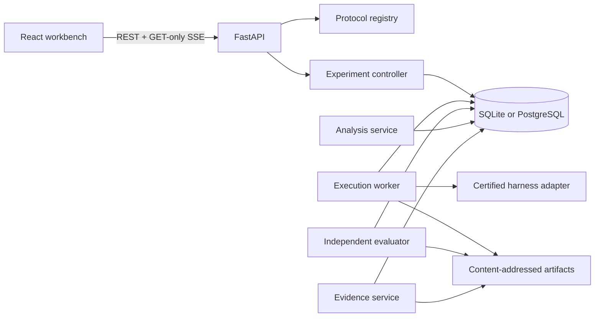
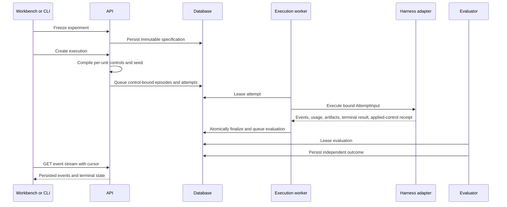

# Architecture

Scaffold Arena is a FastAPI and React system with a durable experimental core. The API process never owns attempt execution.


```mermaid
flowchart LR
    UI["React workbench"] -->|"REST + GET-only SSE"| API["FastAPI"]
    API --> Registry["Protocol registry"]
    API --> Controller["Experiment controller"]
    Controller --> DB[("SQLite or PostgreSQL")]
    Worker["Execution worker"] --> DB
    Worker --> Adapter["Certified harness adapter"]
    Evaluator["Independent evaluator"] --> DB
    Analysis["Analysis service"] --> DB
    Evidence["Evidence service"] --> DB
    Worker --> Artifacts["Content-addressed artifacts"]
    Evaluator --> Artifacts
    Evidence --> Artifacts
```

## Bounded subsystems

### Protocol registry

Validates and versions declarative StudyPacks, scenarios, factors, graders, harnesses, and experiments. Uploaded archives cannot execute code. Freezing produces an immutable specification hash; revisions create linked successors.

### Experiment controller

Expands a frozen design into randomized episodes and replicated attempts. The attempt envelope binds the model endpoint, harness, factor levels, budgets, runtime, code, and evidence configuration. The controller also compiles each unit's frozen sampling values, deterministic seed, harness timeout, and attempt limits into a strict adapter-boundary `AttemptExecutionControls` object. The controls are included in the canonical request and `AttemptInput` identity before a job can be queued.

### Execution workers

Workers lease jobs from the database, invoke adapters, enforce budgets, inject declared faults, and append ordered trace events. Lease expiry immediately removes a worker's authority to heartbeat, finalize, or admit a provider result. Reclaim waits through a fixed grace window longer than the supervisor's maximum poll interval, then applies deterministic capped exponential backoff. A fixed lease-generation cap terminalizes an unresponsive job as failed with incomplete-attempt diagnostic evidence; it is distinct from the explicit scientific attempt-retry budget. SQLite uses one local worker; PostgreSQL uses row locking for team workers.

### Independent evaluator

Evaluation is read-only with respect to the harness. Deterministic graders, state oracles, calibrated qualitative measures, and human annotations produce immutable evaluation records. Agent-side verification remains a treatment mechanism rather than part of this authority.

### Analysis service

Analysis operates on episode-level outcomes and preserves exclusions, retry chains, severe failures, unknown costs, manipulation fidelity, and sample adequacy. It supports paired effects, bootstrap intervals, consistency, Pareto queries, and optional mixed-effects analysis.

### Harness X-Ray and observatories

X-Ray reads a bounded local file/directory manifest or an already captured bounded artifact, then emits only content-addressed, redacted evidence links before report creation. It never executes, installs, replays, crawls, starts a provider, or requests a target network resource. Mechanism states preserve declared, observed, inferred, verified, unsupported, and unknown evidence separately.

The observatory analyses only project-bound persisted events and named custody artifacts. Context and Memory Ledgers, loop and graph microscopes, and the ordered declared→assigned→available→triggered→applied→activated→observed→downstream-pathway fidelity records are diagnostic views over existing evidence, not an executable graph runtime or causal replay. ITT, opportunity, activation, fidelity-failure, and TOT remain unestimated unless their explicit assumptions and denominators are present. Inference remains inference; unknown remains unknown; neither surface is causal, performance, or security-assurance evidence.

### Evidence service

The evidence layer binds experiment, code, runtime, adapter, model, price, evaluator, and artifact hashes. A receipt proves custody and integrity of those named inputs; it does not prove correctness or independence.

## Durable execution flow


```mermaid
sequenceDiagram
    participant U as Workbench or CLI
    participant A as API
    participant D as Database
    participant W as Execution worker
    participant H as Harness adapter
    participant E as Evaluator

    U->>A: Freeze experiment
    A->>D: Persist immutable specification
    U->>A: Create execution
    A->>A: Compile per-unit controls and seed
    A->>D: Queue control-bound episodes and attempts
    W->>D: Lease attempt
    W->>H: Execute bound AttemptInput
    H-->>W: Events, usage, artifacts, terminal result, applied-control receipt
    W->>D: Atomically finalize and queue evaluation
    E->>D: Lease evaluation
    E->>D: Persist independent outcome
    U->>A: GET event stream with cursor
    A-->>U: Persisted events and terminal state
```

Every state transition is idempotent. Execution events have monotonic, execution-scoped sequence numbers so an SSE reconnect can resume without reconstructing observations.

## Executable control identity

Protocol `1.0` remains the durable evidence format. The execution-control contract belongs to the trusted adapter SDK and is carried through the protocol's existing immutable namespaced-extension surface.

```text
Frozen ExperimentSpec
  → randomized unit and deterministic seed
  → AttemptExecutionControls
  → runtime-overlay ScenarioSpec
  → hash-bound AttemptInput
  → adapter/provider request
  → AppliedControls receipt artifact
```

The runtime overlay uses `org.scaffold-arena.execution-controls`. It contains no credentials, authorization headers, provider secrets, or mutable browser state. Its canonical bytes affect the scenario digest, attempt-input binding digest, and request hash. The original StudyPack scenario remains independently recoverable: only the exact Arena-owned runtime namespace is removed before a pinned fixture or state oracle checks the source scenario digest.

`AppliedControls` records whether a requested control was applied, locally bound, unsupported, approximated, or provider-defaulted. The local OpenAI-compatible adapter applies temperature, top-p, maximum output tokens, and seed to the outgoing request. Timeout, tool, context, and retry limits are reported as lifecycle-bound controls. The receipt is content-addressed and persisted with ordinary attempt artifacts. It is evidence about the adapter boundary, not proof that a provider honored a parameter or produced deterministic behavior.

Legacy inputs without the runtime namespace expose a conservative `compatibility_default` view derived from their immutable attempt budget. Newly created durable executions always carry `frozen_experiment` controls.

## Storage

- Database rows store durable metadata, state transitions, bindings, and hashes.
- Large traces, outputs, exports, control receipts, and evaluator results live in a content-addressed artifact store.
- Personal mode uses SQLite WAL and local files.
- Team mode uses PostgreSQL and S3-compatible storage.

## Adapter boundary

An adapter declares support for tools, state, checkpoints, memory, delegation, streaming, usage, cancellation, cleanup, and isolation. Preflight rejects unsupported capabilities. Claim-bearing repository tasks require declared isolation; unsandboxed exploration remains explicitly ineligible. Generation or lifecycle controls that an integration cannot enforce must be represented as unsupported or approximated; silence is not equivalent to support.

## Frontend boundary

The Workbench has Guided and Lab presentations over the same API resources. It recovers StudyPacks, experiments, executions, reports, traces, annotations, and evidence by stable IDs. It does not launch providers, infer preflight success, or recreate missing traces in browser state.

## Security boundary

Personal mode is loopback-only. Team mode adds OIDC Authorization Code with PKCE, opaque server sessions, CSRF protection, project roles, audit records, and fail-closed storage readiness. Legacy `/api/*` endpoints are disabled in team mode.

## Further reading

- [Protocol-v1 boundary](adr/003-protocol-v1-boundaries.md)
- [Durable API, worker, and event architecture](adr/004-durable-api-worker-and-event-architecture.md)
- [Evidence and claim maturity](adr/005-evidence-and-claim-maturity.md)
- [Local and team deployment boundary](adr/006-local-and-team-deployment-boundary.md)
- [Workbench frontend boundaries](adr/007-workbench-v1-frontend-boundaries.md)
