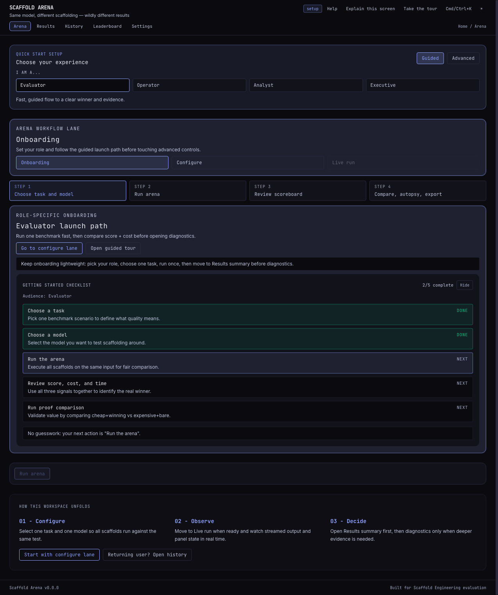

# Scaffold Arena Production Live Demo

*2026-02-23T15:22:57Z by Showboat 0.6.1*
<!-- showboat-id: 71506ea7-c783-41fb-9ecd-0ddb2fe58343 -->

This executable demo proves the deployed Scaffold Arena stack is healthy and correctly connected (frontend on Vercel, backend on Railway).

```bash
curl -sS https://scaffold-arena-production.up.railway.app/api/health | tr -d '\r' | jq -c .
```

```output
{"status":"ok"}
```

```bash
curl -sS https://scaffold-arena-production.up.railway.app/api/meta | jq '{models:(.models|length), tasks:(.tasks|length), scaffolds:(.scaffolds|length)}'
```

```output
{
  "models": 8,
  "tasks": 3,
  "scaffolds": 4
}
```

```bash
curl -I -sS https://scaffold-arena.vercel.app/history | tr -d '\r' | rg -n 'HTTP/|content-type|x-content-type-options|strict-transport-security|referrer-policy|permissions-policy' -i
```

```output
1:HTTP/2 200 
7:content-type: text/html; charset=utf-8
11:permissions-policy: camera=(), microphone=(), geolocation=(), payment=(), usb=()
12:referrer-policy: strict-origin-when-cross-origin
14:strict-transport-security: max-age=63072000; includeSubDomains; preload
15:x-content-type-options: nosniff
```

```bash
curl -sS -X OPTIONS 'https://scaffold-arena-production.up.railway.app/api/meta' -H 'Origin: https://scaffold-arena.vercel.app' -H 'Access-Control-Request-Method: GET' -i | tr -d '\r' | rg -n 'HTTP/|access-control-allow-origin|access-control-allow-methods' -i
```

```output
1:HTTP/2 200 
4:access-control-allow-methods: GET, POST, OPTIONS
5:access-control-allow-origin: https://scaffold-arena.vercel.app
```

Live browser proof captured with Rodney against the production frontend.

```bash {image}
/tmp/scaffold-arena-live-home-v3.png
```


