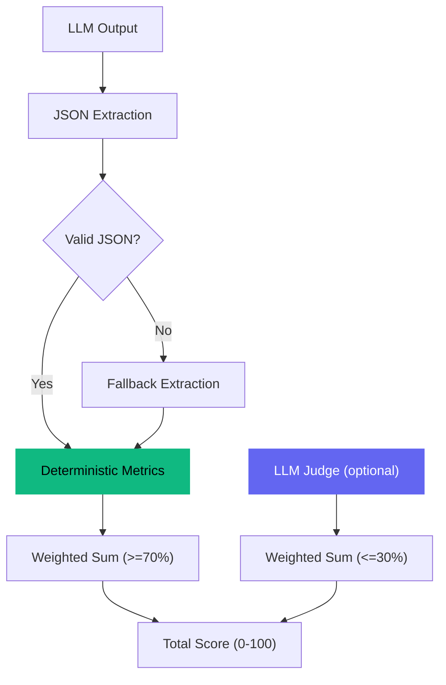

# Evaluation Methodology

> How Scaffold Arena scores LLM outputs — transparently, reproducibly, and without black boxes.

## Design Philosophy

Most LLM evaluation is opaque: send output to GPT-4, get a number back, trust the vibes. Scaffold Arena takes the opposite approach:

1. **Deterministic metrics carry >=70% of the weight** for every task type
2. **Every metric is published** with its weight and calculation method
3. **LLM judge is optional** and never exceeds 30% of the total score
4. **Scoring is reproducible** — same output always produces the same deterministic score



---

## The Scoring Pipeline

### Step 1: JSON Extraction

All scaffold outputs are expected to be JSON. The extraction pipeline uses 4 fallback strategies:

1. **Direct parse** — `json.loads(output)`
2. **Code block extraction** — Find JSON inside ` ```json ``` ` blocks
3. **Brace extraction** — Find the outermost `{...}` in the text
4. **Partial recovery** — Extract what can be found, score the rest as missing

This resilience is critical — a scaffold shouldn't score 0 just because it wrapped JSON in markdown.

### Step 2: Deterministic Metrics

Each task type has specific deterministic metrics. These are computed from the extracted JSON alone — no LLM involved.

### Step 3: LLM Judge (Optional)

When `ENABLE_LLM_JUDGE=true`, the judge evaluates subjective criteria like "reasoning clarity" or "synthesis quality." The judge uses a task-specific rubric and returns scores on a 0-100 scale per metric.

### Step 4: Score Combination

The final score is a weighted sum of all metrics:

```
total_score = sum(metric_score * metric_weight for each metric)
```

When the LLM judge is disabled, judge weights are **redistributed proportionally** to deterministic metrics. This means the total always sums to 100% — the same metrics are used, they just carry more weight.

---

## Weight Tables

### Structured Extraction

**Deterministic: 75% | Judge: 25%**

| Metric | Weight | Type | How It's Calculated |
|--------|:------:|------|---------------------|
| Schema Validity | 45% | Deterministic | Does the output match the expected JSON schema? Checks required keys, value types, nested structure. |
| Field Accuracy | 30% | Deterministic | Field-by-field comparison against gold standard. Exact match for enum values, fuzzy match for text. |
| Completeness | 15% | Judge | How completely did the output capture all information from the input? |
| Reasoning Clarity | 10% | Judge | If explanations are included, are they clear and well-structured? |

**Schema Validity scoring:**
- 100: All required fields present, correct types, valid structure
- 50-99: Minor issues (missing optional fields, slightly wrong types)
- 0-49: Major structural problems (missing required fields, invalid JSON)

**Field Accuracy scoring:**
- Each field compared individually against gold standard
- Exact match: 100 points for that field
- Fuzzy match (>80% similarity): proportional score
- Missing or wrong: 0 points
- Final score: average across all expected fields

### Risk Analysis

**Deterministic: 85% | Judge: 15%**

| Metric | Weight | Type | How It's Calculated |
|--------|:------:|------|---------------------|
| Must-Flag Hit Rate | 45% | Deterministic | What percentage of known must-flag risks were identified? |
| Risk Level Accuracy | 20% | Deterministic | For flagged risks, were severity levels (high/medium/low) correct? |
| False Positive Rate | 10% | Deterministic | Were non-risks incorrectly flagged? Lower rate = higher score. |
| Structure Compliance | 10% | Deterministic | Does the output follow the expected structure/schema? |
| Recommendation Quality | 15% | Judge | Are mitigation recommendations specific and actionable? |

**Must-Flag Hit Rate scoring:**
- Gold standard defines which risk clauses MUST be flagged
- Each must-flag risk checked against the output
- Score = (risks found / total must-flag risks) * 100
- Missing a critical risk has high impact on total score due to 45% weight

**False Positive Rate scoring:**
- Inverted: 100 = no false positives, 0 = all flagged items are false positives
- Encourages precision, not just recall

### Research Synthesis

**Deterministic: 85% | Judge: 15%**

| Metric | Weight | Type | How It's Calculated |
|--------|:------:|------|---------------------|
| Citation Coverage | 35% | Deterministic | What percentage of required sources were cited? |
| Required Findings | 25% | Deterministic | Were key findings from each source included? |
| Schema Validity | 15% | Deterministic | Does the output match the expected JSON schema? |
| Word Count Compliance | 10% | Deterministic | Is the synthesis within the expected length range? |
| Synthesis Quality | 10% | Judge | How well are multiple sources integrated into a coherent narrative? |
| Recommendation Quality | 5% | Judge | Are conclusions and recommendations well-supported? |

**Citation Coverage scoring:**
- Each required source checked for presence in the output
- Fuzzy matching on source titles/authors (>70% similarity threshold)
- Score = (sources cited / required sources) * 100

---

## LLM Judge Details

When enabled, the LLM judge evaluates subjective criteria using a task-specific rubric. The judge:

1. Receives the scaffold output + task context
2. Applies a structured rubric with specific scoring criteria
3. Returns scores (0-100) per subjective metric
4. Provides a brief explanation for each score

The judge uses the same model as the arena run (by default), ensuring consistent evaluation standards. Each metric has a defined rubric — the judge doesn't freelance.

### When to Enable the Judge

| Scenario | Recommendation |
|----------|---------------|
| Quick comparisons | Judge **off** — deterministic metrics are sufficient for ranking |
| Detailed analysis | Judge **on** — adds nuance for qualitative differences |
| Stakeholder reports | Judge **on** — provides richer evaluation narrative |
| Cost-sensitive runs | Judge **off** — saves 1 API call per scaffold per run |

### When the Judge is Disabled

Judge weights are redistributed proportionally to deterministic metrics:

```python
# Example: Extraction with judge disabled
# Original:  schema_validity=45%, field_accuracy=30%, completeness=15%, clarity=10%
# Det total: 45% + 30% = 75%
# Adjusted:  schema_validity = 45/75 = 60%, field_accuracy = 30/75 = 40%
```

The relative importance of deterministic metrics stays the same. The total still sums to 100%.

---

## Score Interpretation

| Score Range | Meaning |
|:-----------:|---------|
| **90-100** | Excellent output. Correct schema, accurate fields, comprehensive coverage. |
| **70-89** | Good output with minor issues. Some fields slightly off, minor formatting problems. |
| **50-69** | Mediocre output. Notable gaps, structural issues, or accuracy problems. |
| **30-49** | Poor output. Major missing fields, wrong structure, or significant errors. |
| **0-29** | Failed output. Invalid JSON, completely wrong schema, or empty/irrelevant response. |

### What the Scores Mean for Scaffolding

Typical score ranges by scaffold (varies by task and model):

| Scaffold | Typical Range | Why |
|----------|:------------:|-----|
| Bare Prompt | 30-55 | No validation, no self-correction, single attempt |
| Plan->Execute->Verify | 60-80 | Structure helps, self-verification catches errors |
| Tool + Error Recovery | 65-85 | Auto-repair loop fixes format issues |
| Memory + Critique | 75-95 | Multi-pass refinement with self-review |

The gap between Bare and Memory+Critique is typically 30-50 points — same model, same task, different scaffolding.

---

## Reproducibility

Deterministic scores are fully reproducible: same output always produces the same score. The only variable is the LLM judge (when enabled), which may vary slightly between runs.

To maximize reproducibility:
- Set `temperature=0` (default)
- Use deterministic-only evaluation (`ENABLE_LLM_JUDGE=false`)
- Compare multiple runs for judge-enabled evaluations
