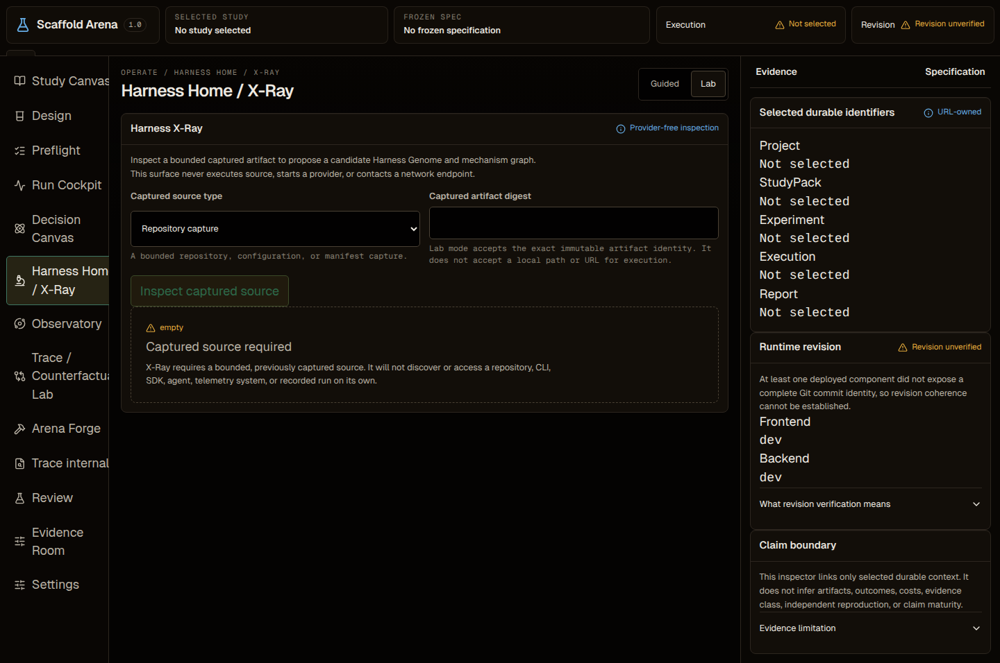
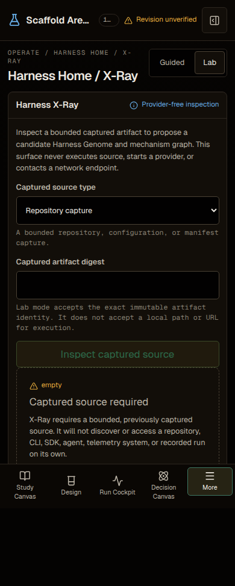
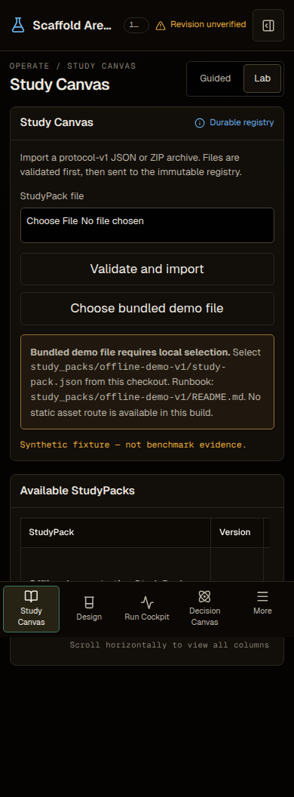
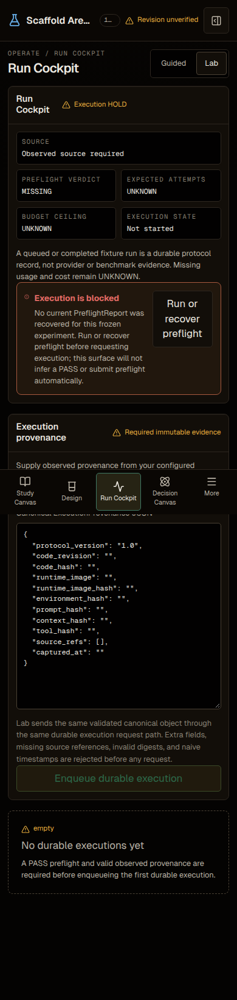
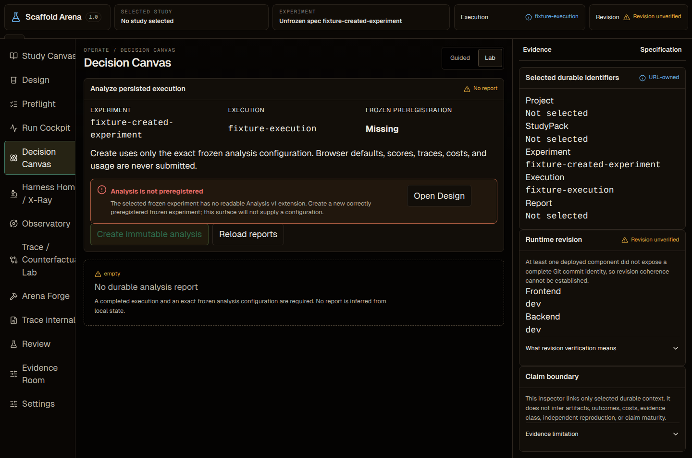
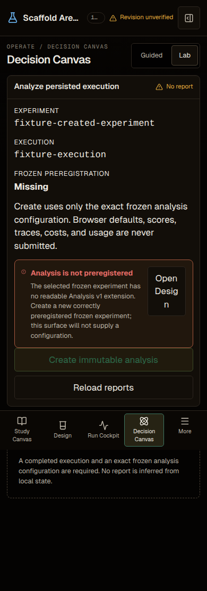
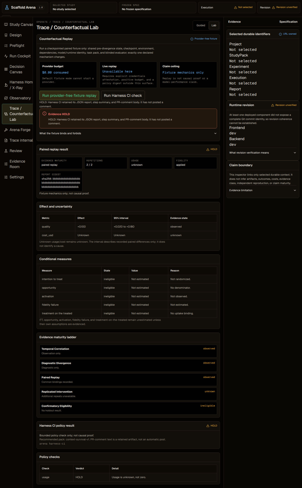
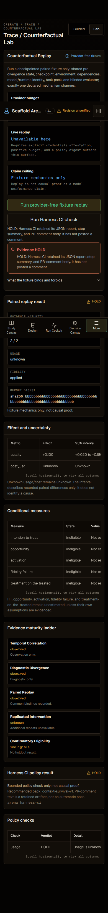
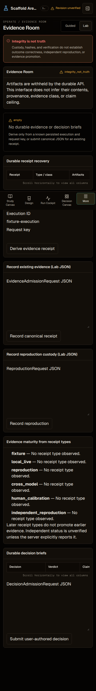

# Product tour

This tour is a deterministic, provider-free view of six Workbench surfaces. Every image is generated from `frontend/tests/support/workbenchV1Mock.ts` at the pinned dark-mode Chrome viewports (1440 × 900 desktop and 390 × 844 mobile). Captures are full-page CSS-pixel PNGs (`scale=css`) from a DPR2 browser: the viewport is fixed, while mobile image heights vary with the complete surface content. The images document fixture, blocked, or empty states; they are not benchmark, live-provider, human-calibration, usability, or release-assurance evidence.

## Harness Home / X-Ray

Route: `/workbench/xray`, with no captured source digest. X-Ray is blocked until a previously captured immutable source is supplied; it does not discover, execute, install, or fetch a source.





## Study Canvas

Route: `/workbench/studies`, with the checked-in `offline-demo-v1@1.0.0` StudyPack returned by the deterministic mock. The visible label is `Synthetic fixture — not benchmark evidence.`




## Run Cockpit

Route: `/workbench/execute?experiment_id=fixture-created-experiment`, with no recovered PreflightReport and an empty execution list. The surface stays `Execution HOLD`; it does not infer a PASS, enqueue work, start a provider, or fabricate a run.




## Decision Canvas

Route: `/workbench/analyze?experiment_id=fixture-created-experiment&execution_id=fixture-execution`, with no durable analysis reports. No effect, winner, cost, confidence interval, or result is inferred from the URL or local state.





## Trace / Counterfactual Lab

Route: `/workbench/counterfactual`. The capture runs the provider-free paired fixture replay and Harness CI policy check. The final state retains `HOLD`, unknown usage/cost, `provider_execution_started=false`, and the boundary that a retained PR-comment body was not posted.





## Evidence Room

Route: `/workbench/evidence?execution_id=fixture-execution`, with empty evidence and decision-brief lists. The surface states `Integrity is not truth` and does not manufacture a receipt, result, provenance chain, or evidence promotion.




## Reproduce the capture set

```bash
cd frontend
CAPTURE_DOCUMENTATION_ASSETS=1 npx -y pnpm@10 exec playwright test tests/visual/product-tour-v1.spec.ts --project=visual
```

The capture command writes exactly twelve allowlisted PNGs under `docs/assets/screenshots/v1/product-tour/`. The provenance checker verifies routes, surface IDs, alt text, viewport metadata, PNG dimensions and digests, generator and fixture hashes, the `frontend/src` tree hash, render-input hashes, and browser identity. A passing check establishes only agreement between the checked-in bytes and this deterministic fixture/blocked reproduction contract.
