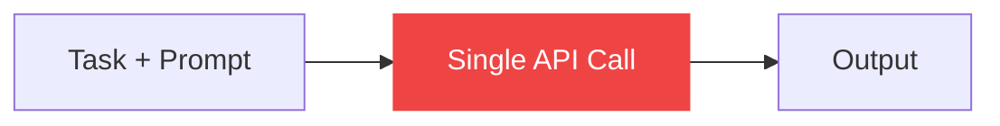
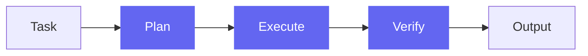
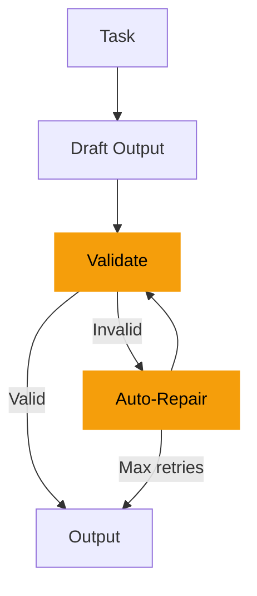
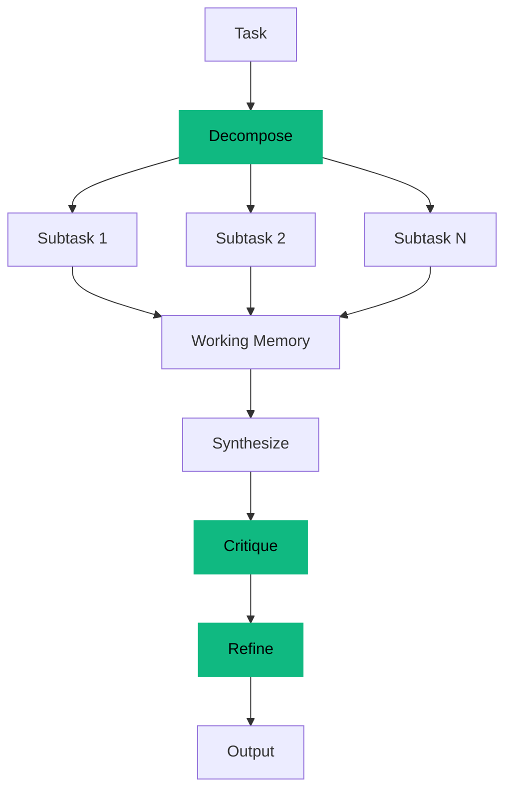

# Scaffold Architectures

> Four fundamentally different approaches to orchestrating the same LLM. Same model. Same prompt. Wildly different results.

## What Is a Scaffold?

A **scaffold** is the orchestration code around an LLM call. It defines:
- How the task is decomposed
- How many API calls are made
- Whether the output is validated
- Whether the model gets to self-correct

The model itself doesn't change. The scaffolding does all the work.

```
                    ┌─────────────────────────────────────────────────────────┐
                    │              SCAFFOLD COMPLEXITY SPECTRUM                │
                    │                                                         │
  Simplest <────────────────────────────────────────────────────> Most Complex
                    │                                                         │
   Bare             │   Plan->Execute     Tool + Error       Memory +         │
   Prompt           │   ->Verify          Recovery           Critique         │
                    │                                                         │
   1 API call       │   3 API calls      2-5 API calls      5-7 API calls    │
   No orchestration │   Structured       Validation loop    Multi-pass        │
                    │   decomposition    with auto-repair   with self-review  │
                    │                                                         │
                    └─────────────────────────────────────────────────────────┘
```

---

## 1. Bare Prompt

**Strategy:** Zero scaffolding. The control group.



### How It Works

1. Send the task text + output schema to the model in a single prompt
2. Stream the response back
3. Done

### Why It Exists

Bare Prompt is the **control group**. Every other scaffold is measured against it. If a scaffold can't beat single-shot, it's not worth the complexity.

### What Goes Wrong

Without any scaffolding, the model frequently:
- **Misses required fields** — no checklist to verify against
- **Produces invalid JSON** — no validation step to catch errors
- **Hallucinates confidently** — no critique step to question itself
- **Stops early** — no decomposition to ensure comprehensive coverage

### Implementation

```python
class BareScaffold(BaseScaffold):
    id = "bare"
    name = "Bare Prompt"
    subtitle = "Single-shot, no scaffolding"

    async def run(self, ...):
        yield ("scaffold_phase", phase_event("generating"))

        async for delta in provider.stream_text(
            model_id=model_id,
            messages=[{"role": "user", "content": task.get_input_text()}],
        ):
            yield ("scaffold_delta", delta_event(delta))

        yield ("final_output", {"output": full_text})
```

### Typical Performance

| Metric | Range |
|--------|-------|
| Score | 30-55 |
| API Calls | 1 |
| Cost | Lowest |
| Time | Fastest |

---

## 2. Plan -> Execute -> Verify

**Strategy:** Structured decomposition with self-verification.



### How It Works

**Phase 1: Plan** (non-streaming)
- The model reads the task and creates an execution plan
- The plan identifies key steps, potential pitfalls, and output requirements

**Phase 2: Execute** (streaming)
- The model executes its plan, producing the actual output
- The plan is included as context, so the model follows its own roadmap

**Phase 3: Verify** (non-streaming)
- The model reviews its own output against the schema
- Identifies any issues (missing fields, format errors, logic problems)
- If issues are found, provides a corrected version

### Why It Works

Planning forces the model to think before acting. Verification catches errors that would otherwise ship. The structure prevents the "generate and pray" pattern.

### What It's Good At

- **Schema compliance** — the verify step catches format errors
- **Completeness** — the plan ensures nothing is forgotten
- **Structured tasks** — extraction and risk analysis benefit most

### Implementation

```python
class PlanExecuteVerifyScaffold(BaseScaffold):
    id = "plan_execute_verify"
    name = "Plan → Execute → Verify"
    subtitle = "Plan approach, execute, then self-verify"

    async def run(self, ...):
        # Phase 1: Plan
        yield ("scaffold_phase", phase_event("planning"))
        plan = await provider.complete(messages=[plan_prompt])

        # Phase 2: Execute
        yield ("scaffold_phase", phase_event("executing"))
        async for delta in provider.stream_text(messages=[execute_prompt]):
            yield ("scaffold_delta", delta_event(delta))

        # Phase 3: Verify
        yield ("scaffold_phase", phase_event("verifying"))
        verification = await provider.complete(messages=[verify_prompt])
```

### Typical Performance

| Metric | Range |
|--------|-------|
| Score | 60-80 |
| API Calls | 3 |
| Cost | Moderate |
| Time | Moderate |

---

## 3. Tool + Error Recovery

**Strategy:** Validation loop with automatic error repair.



### How It Works

**Phase 1: Draft** (streaming)
- Generate initial output normally

**Phase 2: Validate** (non-streaming)
- Check the output against the expected JSON schema
- Verify required fields are present
- Check value types and constraints

**Phase 3: Repair** (if validation fails, streaming)
- Send the validation errors back to the model
- Ask it to fix the specific issues
- Re-validate the fixed output

**Repeat** phases 2-3 up to 3 times.

### Why It Works

Most LLM errors are **fixable with feedback**. A missing field, a wrong type, an extra comma — the model can fix these if told exactly what's wrong. The validation loop converts format failures into correctable errors.

### What It's Good At

- **JSON schema compliance** — the validation loop ensures valid output
- **Error recovery** — specific error messages guide targeted fixes
- **Cost efficiency** — only loops when errors exist (often 0-1 repairs)

### Implementation

```python
class ToolErrorRecoveryScaffold(BaseScaffold):
    id = "tool_error_recovery"
    name = "Tool + Error Recovery"
    subtitle = "Validate output, auto-repair errors"

    async def run(self, ...):
        for attempt in range(max_attempts):
            # Draft or repair
            yield ("scaffold_phase", phase_event("generating" if attempt == 0 else "repairing"))
            output = await generate_or_repair(...)

            # Validate
            yield ("scaffold_phase", phase_event("validating"))
            errors = validate_against_schema(output, task.get_schema())

            if not errors:
                break  # Valid output, we're done
```

### Typical Performance

| Metric | Range |
|--------|-------|
| Score | 65-85 |
| API Calls | 2-5 |
| Cost | Moderate-High |
| Time | Variable |

---

## 4. Memory + Critique

**Strategy:** Multi-pass refinement with decomposition and self-review.



### How It Works

**Phase 1: Decompose** (non-streaming)
- Break the task into 2-4 subtasks
- Each subtask has a clear goal and expected output

**Phase 2: Subtasks** (non-streaming, sequential)
- Solve each subtask independently
- Store results in working memory
- Each subtask has access to the full task context

**Phase 3: Synthesize** (streaming)
- Combine all subtask results into a single output
- Working memory provides comprehensive context
- Schema-aware synthesis ensures structural compliance

**Phase 4: Critique** (non-streaming)
- Self-review the synthesized output
- Score on completeness, correctness, and format
- Identify top 3 weaknesses

**Phase 5: Refine** (streaming)
- Address the identified weaknesses
- Produce the final, improved output

### Why It Works

This scaffold mimics how expert humans work:
1. Break the problem down
2. Solve each part
3. Combine the parts
4. Review your work
5. Fix the weaknesses

The critique step is especially powerful — the model identifies its own blind spots and has a chance to fix them.

### What It's Good At

- **Complex tasks** — decomposition handles multi-part problems well
- **Comprehensive coverage** — subtasks ensure nothing is missed
- **Quality** — critique + refinement polishes the output
- **Research synthesis** — natural fit for multi-source reasoning

### Implementation

```python
class MemoryCritiqueScaffold(BaseScaffold):
    id = "memory_critique"
    name = "Memory + Critique"
    subtitle = "Decompose → subtasks → synthesize → critique → refine"

    async def run(self, ...):
        # Decompose
        subtasks = await decompose(task)

        # Solve subtasks
        working_memory = []
        for subtask in subtasks:
            result = await solve_subtask(subtask, task_context)
            working_memory.append(result)

        # Synthesize
        candidate = await synthesize(working_memory, task, schema)

        # Critique
        weaknesses = await critique(candidate)

        # Refine
        final = await refine(candidate, weaknesses)
```

### Typical Performance

| Metric | Range |
|--------|-------|
| Score | 75-95 |
| API Calls | 5-7 |
| Cost | Highest |
| Time | Longest |

---

## Comparison Summary

| | Bare | Plan->Exec->Verify | Tool+Error | Memory+Critique |
|---|:---:|:---:|:---:|:---:|
| **API Calls** | 1 | 3 | 2-5 | 5-7 |
| **Self-Verification** | No | Yes | Yes (schema) | Yes (critique) |
| **Error Recovery** | No | No | Yes (auto-repair) | Yes (refinement) |
| **Task Decomposition** | No | Implicit (plan) | No | Yes (subtasks) |
| **Best For** | Baseline | Structured output | Schema compliance | Complex reasoning |
| **Typical Score** | 30-55 | 60-80 | 65-85 | 75-95 |
| **Cost** | $ | $$ | $$-$$$ | $$$$ |

### When to Use Each

- **Bare Prompt**: When you need a baseline, or when cost/speed matter more than quality
- **Plan->Execute->Verify**: When the task has clear structure and the model just needs to follow a plan
- **Tool + Error Recovery**: When schema compliance is critical and errors are fixable
- **Memory + Critique**: When quality is paramount and the task benefits from multi-pass reasoning

### The Cost-Quality Tradeoff

More scaffolding = more API calls = higher cost. But the quality improvement is not linear — it's usually exponential. Going from Bare (1 call) to Memory+Critique (5-7 calls) might cost 5-7x more per run, but the score improvement is often 2-3x.

The 3-case Proof Comparison quantifies this tradeoff precisely by comparing quality-per-dollar (QPD) across configurations.

---

## Adding Custom Scaffolds

To add a new scaffold:

1. Create a new file in `backend/scaffolds/`
2. Extend `BaseScaffold`
3. Implement the `run()` async generator
4. Register in `main.py`'s startup handler

```python
from scaffolds.base import BaseScaffold

class MyCustomScaffold(BaseScaffold):
    id = "my_custom"
    name = "My Custom Scaffold"
    subtitle = "Description of the approach"

    async def run(self, run_id, task, model_id, provider, options,
                  config_override=None, cancelled_check=None):
        # Yield events as you go
        yield ("scaffold_phase", phase_event(run_id, self.id, "my_phase"))

        # Make API calls
        result = await provider.complete(model_id=model_id, messages=[...])
        yield ("usage", {"input_tokens": ..., "output_tokens": ...})

        # Stream final output
        async for delta in provider.stream_text(...):
            yield ("scaffold_delta", delta_event(run_id, self.id, delta))

        yield ("final_output", {"output": full_text})
```

Then register it:

```python
# In main.py startup handler
from scaffolds.my_custom import MyCustomScaffold
register_scaffold(MyCustomScaffold())
```

The new scaffold will automatically appear in the UI.
