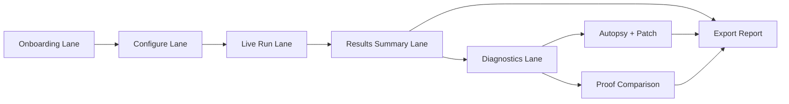

# User Guide

> Everything you need to know to use Scaffold Arena effectively.

For role-based docs, start at [`docs/README.md`](README.md).

## What Scaffold Arena Does

Scaffold Arena answers one question: **Does the code around the AI model matter more than the model itself?**

It does this by running the same task through four different scaffold architectures simultaneously, scoring the results transparently, and then proving that a well-scaffolded cheap model outperforms an expensive model with no scaffolding.

## The Workflow

Every step builds on the previous one. You can stop at any point — but the full workflow tells the complete story.

---

## Step 1: Onboarding Lane (Role + First Action)

Start in the **Onboarding lane** and choose a role path (Evaluator, Operator, Analyst, or Executive). This sets the first recommended action and keeps early decisions focused.

Then pick one task as your benchmark target:

The task selector shows available tasks as clickable cards. Each task tests different AI capabilities:

### Structured Extraction

**What it tests:** Precision and schema adherence.

The model receives a synthetic legal amendment and must extract structured fields into a specific JSON schema. Scoring focuses on whether the output is valid JSON, whether each field matches the expected value, and how completely the information was captured.

**Best for:** Demonstrating that scaffolding dramatically improves structured output quality.

### Risk Analysis

**What it tests:** Judgment, completeness, and false positive control.

The model receives a synthetic vendor contract and must identify risk clauses, classify severity levels, and provide recommendations. Scoring checks whether all must-flag risks were found, whether severity ratings match the gold standard, and whether the model generated false positives.

**Best for:** Showing that multi-step scaffolds catch risks that single-shot approaches miss.

### Research Synthesis

**What it tests:** Multi-source reasoning and citation discipline.

The model receives synthetic research sources and must synthesize findings with proper citations. This task uses **synthetic sources** (clearly labeled throughout the UI) to ensure reproducibility.

**Best for:** Demonstrating citation accuracy and synthesis quality differences.

---

## Step 2: Configure Lane (Task, Model, Run)

Use the **Configure lane** to confirm task + model, check the cost estimate, and then click **"Run Arena"**.

This launches all four scaffold architectures simultaneously.

---

## Step 3: Live Run Lane (Watch Execution)

After starting the run, use the **Live run lane** to monitor scaffold progress and streaming output.

### What You'll See

**Four live panels** appear, one per scaffold:

- **Bare Prompt** — Single API call, no orchestration. The control group.
- **Plan -> Execute -> Verify** — Plans the approach, executes it, then self-verifies.
- **Tool + Error Recovery** — Drafts output, validates, auto-repairs errors.
- **Memory + Critique** — Decomposes into subtasks, synthesizes, self-critiques, refines.

Each panel shows:
- A **pulsing indicator** while the scaffold is running
- The **current phase** (planning, executing, verifying, etc.)
- **Streaming text** as tokens are generated
- **Metrics** once complete (tokens used, cost, time, API calls)

### During the Run

- You can watch tokens stream in real-time across all 4 panels
- Panels complete independently — some scaffolds finish faster than others
- The Bare Prompt scaffold will almost always finish first (1 API call vs. 3-7)

### Cancellation

Click **"Cancel"** to stop the arena run. All scaffolds will stop at their next cancellation checkpoint (between API calls).

---

## Step 4: Results Summary Lane (Decision First)

After all scaffolds complete, move to **Results Summary lane** to review ranked outcomes before deep diagnostics.

### Reading the Dashboard

| Column | Meaning |
|--------|---------|
| **Rank** | Position by score (highest first) |
| **Scaffold** | The scaffold architecture name |
| **Score** | Weighted score out of 100 |
| **Cost** | Total API cost in USD |
| **Time** | Wall-clock execution time |

The **winner** is highlighted with an emerald border and badge. Losing scaffolds show an "Autopsy" button.

### Score Breakdown

**Hover over any score** to see the full metric breakdown. Each metric shows:
- The raw score (0–100)
- The weight applied to this metric
- Whether it's deterministic or judge-scored

All deterministic metrics are computed from the output alone — no LLM involved. See [Evaluation Methodology](evaluation.md) for details.

---

## Step 5: Run Proof Comparison (Diagnostics Lane)

This is the "aha moment." Click **"Run Proof Comparison"** to prove scaffold value with three head-to-head cases:

| Case | What It Tests |
|------|---------------|
| **Cheap model + winning scaffold** | Can a cheap model with good scaffolding beat an expensive model? |
| **Expensive model + no scaffold** | What does raw model power alone produce? |
| **Expensive model + winning scaffold** | What's the best possible result? |

### Reading the Results

The comparison table shows:
- **Score** — How well each case performed
- **Cost** — How much each case cost
- **QPD (Quality Per Dollar)** — Score divided by (cost x 1000). Higher = better value.
- **Delta** — Score and cost difference from the first case

### The Key Insight

Case 1 (cheap + scaffolding) vs. Case 2 (expensive + bare) is the money shot:
- If Case 1 scores higher at lower cost, scaffolding beats model upgrades
- The QPD column quantifies exactly how much more value scaffolding delivers

---

## Step 6: Diagnose Failures

Click **"Autopsy"** on any losing scaffold to understand *why* it scored lower.

### What the Autopsy Shows

Each failure is classified with:
- **Type** — What went wrong (missing field, invalid format, hallucinated content, etc.)
- **Severity** — How much it impacted the score (critical, major, minor)
- **Evidence** — Concrete proof from the output (exact text, missing fields, incorrect values)

### Machine-Applicable Patches

The autopsy generates a **patch** — a JSON object describing how to fix the scaffold's configuration. This might include:
- Additional system prompt instructions
- Schema enforcement rules
- Validation step additions

---

## Step 7: Patch & Rerun

Click **"Apply Patch & Rerun"** to test the autopsy's suggested fix.

This runs the same scaffold with the patch applied, so you can immediately see if the fix improves the score. The patched run appears as a new entry, making it easy to compare before vs. after.

---

## Step 8: Export Report

Click **"Export Report"** to generate a comprehensive audit report.

### Report Contents

The report includes:
- **Arena summary** — Task, model, all scaffold scores
- **Detailed metrics** — Per-scaffold breakdown with individual metric scores
- **Comparison data** — 3-case proof results (if run)
- **Autopsy findings** — Failure classification and evidence (if run)
- **Methodology** — How scoring works, weight tables

### Download Options

- **Markdown (.md)** — Always available. Great for pasting into documents or wikis.
- **PDF (.pdf)** — Available when PDF export is enabled. Formatted for printing or email.

---

## Understanding Costs

Scaffold Arena tracks real costs using actual token counts returned by the active model provider API. No estimates.

### Cost Factors

| Factor | Impact |
|--------|--------|
| **Model choice** | Example pricing: Sonnet 4.6 ($3/$15 per MTok), Haiku 4.5 ($1/$5), GPT-4.1 ($2/$8), GPT-4.1 mini ($0.4/$1.6), Gemini 2.5 Flash ($0.3/$2.5), OpenRouter GPT-4.1 mini ($0.5/$2.0). |
| **Scaffold complexity** | Bare = 1 API call. Memory+Critique = 5-7 API calls. More calls = more tokens = more cost. |
| **Task length** | Longer input documents use more input tokens per call. |
| **LLM Judge** | If enabled, adds ~1 extra API call per scaffold for subjective scoring. |

### Typical Costs

A full arena run (4 scaffolds) on a medium-length task typically costs $0.10–0.30 with Sonnet 4.6, or $0.03–0.10 with Haiku 4.5. The 3-case proof comparison adds another $0.05–0.15.

---

## Tips for Getting the Most Out of Scaffold Arena

1. **Start with Structured Extraction** — It's the fastest task and shows the most dramatic scaffold differences.

2. **Compare QPD, not just scores** — A scaffold that scores 85 at $0.01 is more valuable than one that scores 92 at $0.05.

3. **Always run the Proof Comparison** — The arena shows scaffold differences; the comparison proves real-world value.

4. **Read the autopsy evidence** — The specific failures explain *why* scaffolding matters, not just *that* it matters.

5. **Try cross-provider comparisons** — Running the same task on Claude and GPT models shows how scaffolding can compensate for raw model differences.

6. **Export for stakeholders** — The report tells the complete story in a format non-technical readers can follow.
