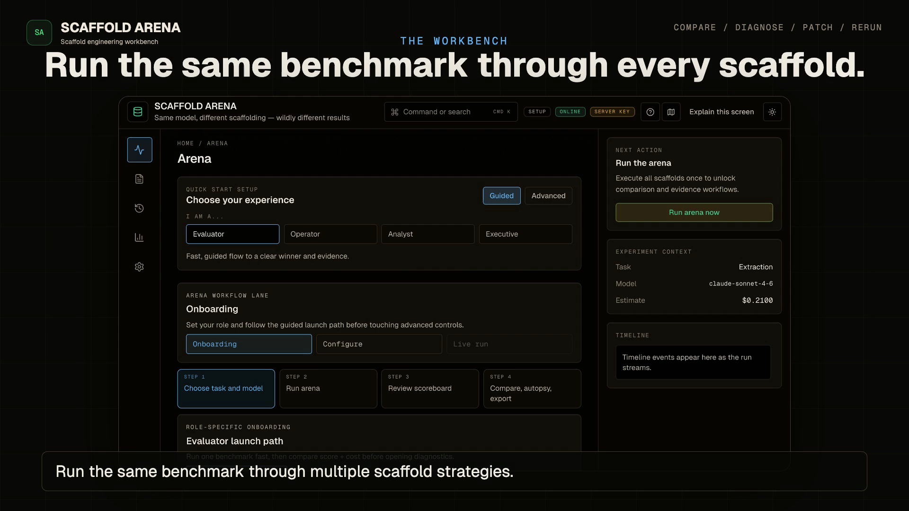
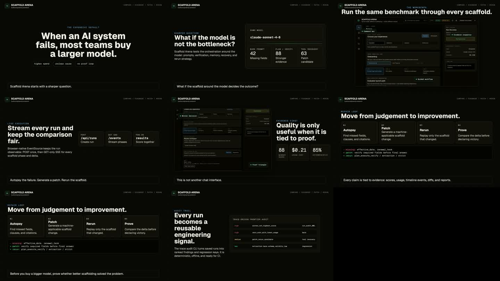

# Video Assets

This directory contains repo-owned product video assets for Scaffold Arena.

## Scaffold Arena Overview

[](scaffold-arena-overview/renders/scaffold-arena-overview.mp4)

- Final render: [`scaffold-arena-overview/renders/scaffold-arena-overview.mp4`](scaffold-arena-overview/renders/scaffold-arena-overview.mp4)
- Duration: 66 seconds
- Format: 1920x1080, 30fps, H.264 video, AAC audio
- Source composition: [`scaffold-arena-overview/index.html`](scaffold-arena-overview/index.html)
- Narration script: [`scaffold-arena-overview/narration.txt`](scaffold-arena-overview/narration.txt)
- Poster frame: [`scaffold-arena-overview/assets/poster.png`](scaffold-arena-overview/assets/poster.png)



## Rebuild

```bash
cd docs/videos/scaffold-arena-overview
npm run check
npx --yes hyperframes@0.5.5 inspect --samples 15
npm run render -- --output renders/scaffold-arena-overview.mp4 --quality high
```

Voiceover was generated locally with Kokoro TTS:

```bash
python3 -m venv /tmp/hyperframes-tts-venv
. /tmp/hyperframes-tts-venv/bin/activate
python -m pip install --upgrade pip
python -m pip install kokoro-onnx soundfile
npx --yes hyperframes@0.5.5 tts narration.txt \
  --voice bm_george \
  --speed 0.86 \
  --output assets/narration.wav
```
