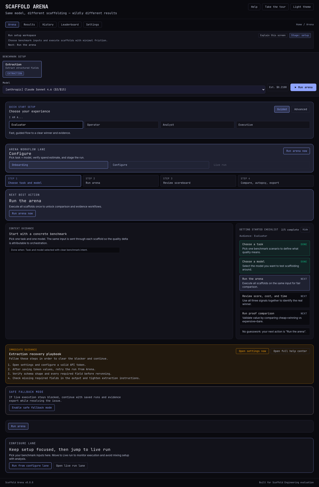
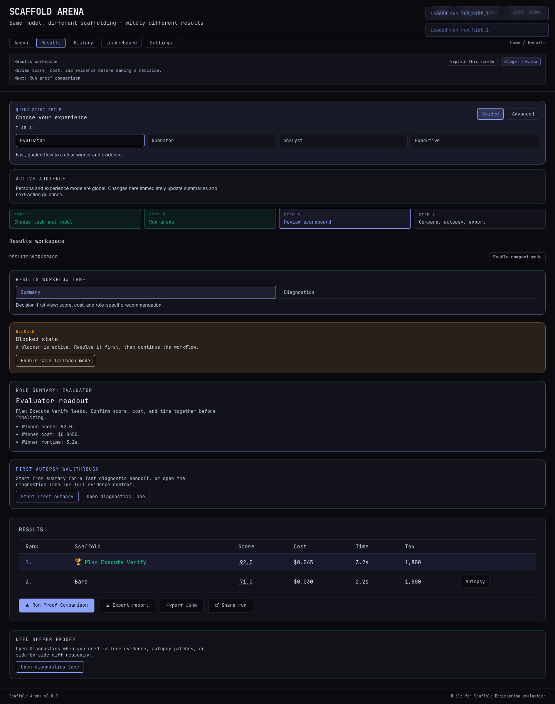
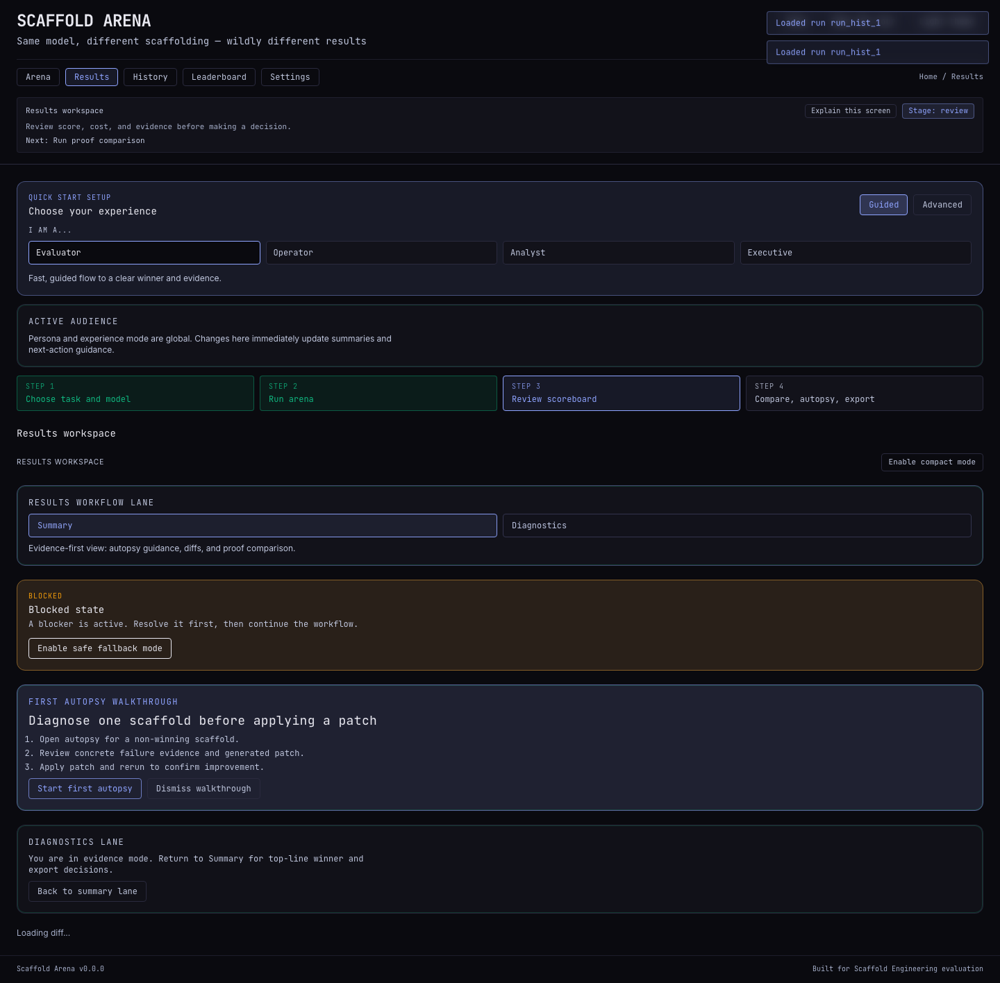
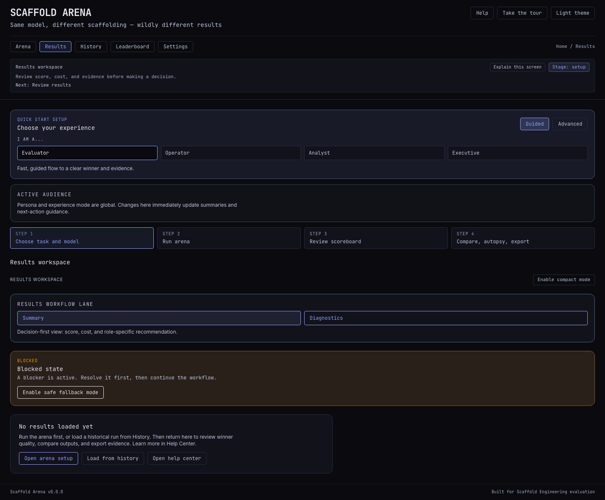
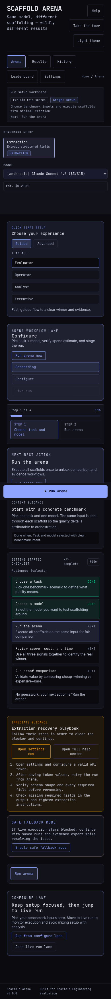
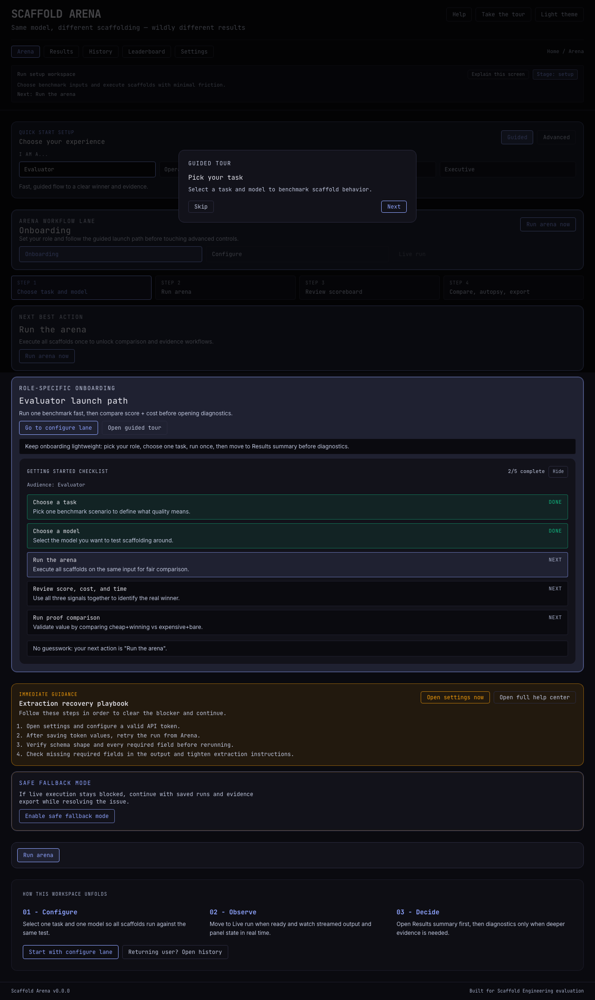
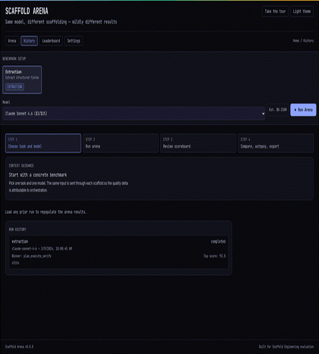

# Product Walkthrough

This walkthrough is optimized for first-time stakeholders and evaluators.

## 1. Arena Workspace Lanes

- **Onboarding lane:** pick role + guided-first path.
- **Configure lane:** select task/model and launch run.
- **Live run lane:** monitor streaming output and scaffold phases.

## 2. Results Summary Lane

- Decision-first view for score, cost, and time.
- Persona-tailored summary copy for Evaluator/Operator/Analyst/Executive.
- Export-ready framing before deep diagnostics.

## 3. Results Diagnostics Lane

- Diff, autopsy, and proof comparison live in one evidence-focused lane.
- Timeline replay supports event-by-event diagnostics.
- First-autopsy walkthrough supports patch-first iteration.
- Summary/diagnostics toggle keeps progressive disclosure intact.

## 4. Historical Context

- Reopen previous runs.
- Compare improvements over time.
- Use run history for reproducibility.

## 5. Performance Leadership View

- Track win rate and average score by scaffold.
- Inspect distribution bins for consistency.

## 6. Operational Controls

- Theme, notifications, and telemetry consent.
- Session-first key storage mode + explicit persistence opt-in.
- Last preflight readiness summary and remediation hints.

## 7. Power User Navigation

- `Cmd/Ctrl+K` opens the command palette for fast workspace/action switching.
- Useful live-demo commands: run benchmark, open diagnostics, export bundle.

## 8. Mobile Experience

- Responsive controls and readability at phone sizes.
- Critical actions preserved in compact layouts.

## 9. Guided Onboarding

- First-visit tour variant support.
- Re-openable onboarding for returning users.

## 10. Visual Journey Animation

## Suggested Demo Script (4-6 minutes)

1. Start in Onboarding lane and explain role-based guidance.
2. Move to Configure lane, launch run, and switch to Live run lane.
3. Open Results Summary lane for decision-first score/cost framing.
4. Switch to Diagnostics lane, run one autopsy, and show evidence quality.
5. Trigger proof comparison and explain QPD economics.
6. Export report and close with stakeholder decision framing.
